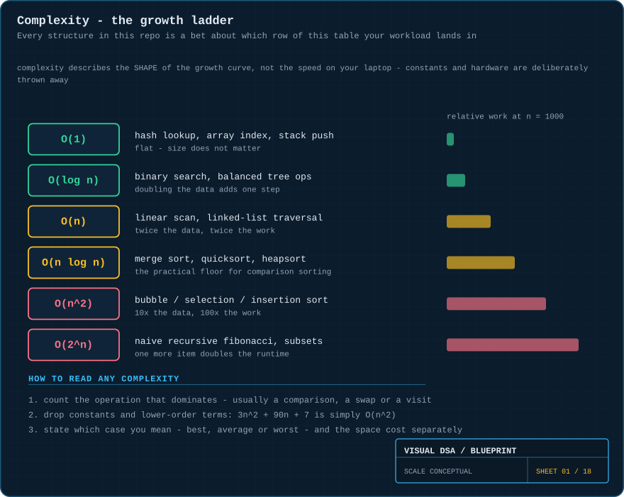
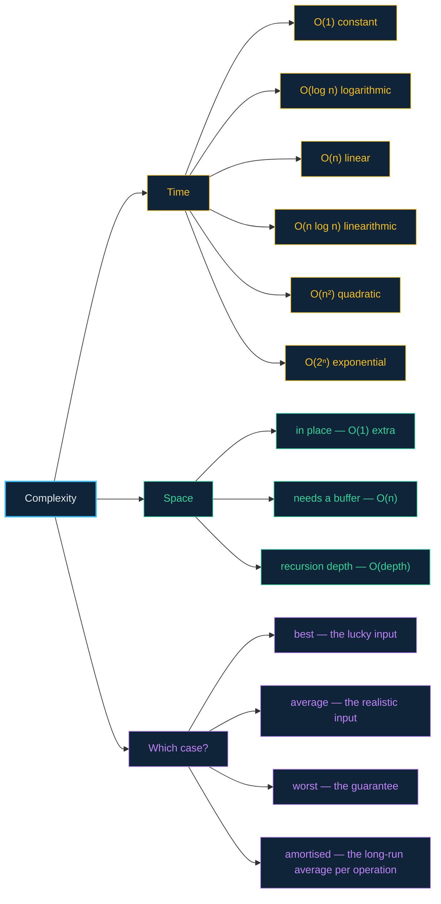

# 01 · Foundations — complexity, and why it is the only vocabulary that matters

> **The analogy.** Two people offer to find a name in a phone book. One flips page by page; the other opens it in the middle and halves it. For a 10-page book you cannot tell them apart. For a 10-million-entry book, one finishes in 24 steps and the other is still going next week. Big-O is the notation for that difference — and it deliberately ignores who has the faster hands.

---

## 📊 How the curves actually diverge


Each curve is labelled at the point it leaves the chart. That exit point *is* the algorithm's practical ceiling.

---

## 🧠 Mental model

| In the real world | In complexity notation |
|:--|:--|
| "how long does it take?" | **wrong question** — depends on the machine |
| "how does the time change when the job gets bigger?" | **right question** — that is O(·) |
| doubling the work and it takes twice as long | `O(n)` |
| doubling the work and it takes one extra step | `O(log n)` |
| doubling the work and it takes four times as long | `O(n²)` |
| adding one item and it takes twice as long | `O(2ⁿ)` — you have a problem |

Big-O throws away constants and lower-order terms **on purpose**. `3n² + 90n + 7` is `O(n²)`, because for large enough `n` the `n²` term buries everything else. This is not sloppiness; it is the whole point. It makes the comparison portable across machines, languages and years.

---

## 📐 Blueprint



---

## 🗺️ Mindmap



---

## ⚙️ How to derive a complexity

```text
1. find the operation that dominates
   usually a comparison, a swap, a visit or an allocation

2. count how many times it runs, as a function of n

   for i ← 0 to n-1 do          →  n iterations             →  O(n)
       visit(i)

   for i ← 0 to n-1 do          →  n × n iterations         →  O(n²)
       for j ← 0 to n-1 do
           visit(i, j)

   while n > 1 do               →  n halves log₂ n times    →  O(log n)
       n ← n / 2

3. drop constants and lower-order terms
   3n² + 90n + 7   →   O(n²)

4. state the case and the space separately
   "O(n log n) average time, O(n) auxiliary space"
```

**Two rules that cover most code:**

- **Sequential blocks add**, and addition is dominated by the larger: `O(n) + O(n²) = O(n²)`.
- **Nested blocks multiply**: a loop over `n` containing a loop over `m` is `O(n·m)`.

---

## ⏱️ The reference numbers

The table behind the chart above. `n = 1,000,000`:

| Complexity | Operations at n = 1,000,000 | Feels like |
|:--|--:|:--|
| `O(1)` | 1 | instant, forever |
| `O(log n)` | ~20 | instant, forever |
| `O(n)` | 1,000,000 | milliseconds |
| `O(n log n)` | ~20,000,000 | still fine |
| `O(n²)` | 1,000,000,000,000 | hours to days |
| `O(2ⁿ)` | more than atoms in the observable universe | never |

---

## ⚖️ Trade-offs

| ✅ What Big-O is good for | ❌ What it will mislead you about |
|:--|:--|
| comparing algorithms as data grows | small inputs — an `O(n²)` sort beats an `O(n log n)` one below ~20 items |
| spotting the choice that will not survive scale | constant factors — two `O(n)` algorithms can differ 100× |
| reasoning before you have written any code | cache behaviour — a contiguous `O(n)` scan can beat a scattered `O(log n)` walk |
| communicating a design decision in one symbol | actual latency — always measure the thing you shipped |

---

## 🃏 Flashcards

<details><summary>Why does Big-O drop constants?</summary>

So the answer stays true on any machine, in any language, in any year. Constants describe *your hardware*; the growth rate describes *the algorithm*. For large enough `n` the growth rate always wins.
</details>

<details><summary>What is the difference between worst case and amortised?</summary>

**Worst case** is the most expensive single operation. **Amortised** is the average cost per operation across a long sequence. Appending to a dynamic array is `O(n)` in the worst case (the resize) but `O(1)` amortised, because the expensive resize is rare and pays for many cheap appends.
</details>

<details><summary>An algorithm is O(n²). Is it unusable?</summary>

No. It is unusable *at scale*. `n = 50` is 2,500 operations — nothing. `n = 1,000,000` is a trillion. Big-O tells you where the wall is, not that there is one everywhere.
</details>

<details><summary>Why is O(n log n) the floor for comparison-based sorting?</summary>

There are `n!` possible orderings, and each comparison gives you one bit of information. You need at least `log₂(n!)` comparisons to distinguish them, and `log₂(n!)` is `Θ(n log n)`. Sorts that beat it (counting sort, radix sort) do not compare elements — they exploit the structure of the keys.
</details>

<details><summary>What does O(1) actually promise?</summary>

That the cost does not grow with `n`. **Not** that it is fast. A hash lookup that computes an expensive hash is `O(1)` and can still be slower than scanning a 10-element array.
</details>

<details><summary>Space complexity: what counts?</summary>

Extra memory beyond the input. Merge sort is `O(n)` space because of the merge buffer; quicksort is `O(log n)` because of the recursion stack; bubble sort is `O(1)` because it only ever swaps in place.
</details>

---

## ❓ Quiz

**1.** A function contains a loop over `n` followed by a nested double loop over `n`. What is its complexity?

<details><summary>Answer</summary>

**`O(n²)`.** Sequential blocks add — `O(n) + O(n²)` — and addition is dominated by the larger term.
</details>

**2.** Algorithm A is `O(n)` with a constant factor of 1000. Algorithm B is `O(n²)` with a constant factor of 1. At `n = 10`, which is faster?

<details><summary>Answer</summary>

**B.** 10,000 operations versus 100. Big-O describes the *limit*, and at `n = 10` you are nowhere near it. The crossover is at `n = 1000`. This is exactly why real sort implementations switch to insertion sort for small runs.
</details>

**3.** You halve a search range repeatedly until one element remains. Starting from 1,048,576 elements, how many halvings?

<details><summary>Answer</summary>

**20**, because 2²⁰ = 1,048,576. That is `log₂ n`, and it is why binary search feels like it barely notices how big the input is.
</details>

**4.** Which is a *space* complexity claim, not a time one: "merge sort needs a buffer as large as the input"?

<details><summary>Answer</summary>

**Space** — `O(n)` auxiliary space. Its *time* is `O(n log n)`. The two are reported separately and trade against each other constantly: memoisation in dynamic programming buys time with space.
</details>

---

⬅️ [00 · How to read this](00-how-to-read-this.md) · [🏠 Index](../README.md) · [02 · Arrays](02-arrays.md) ➡️
