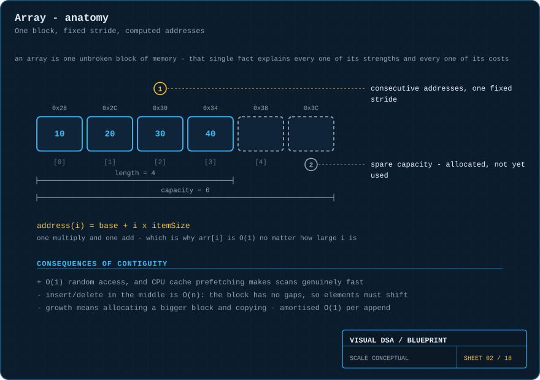
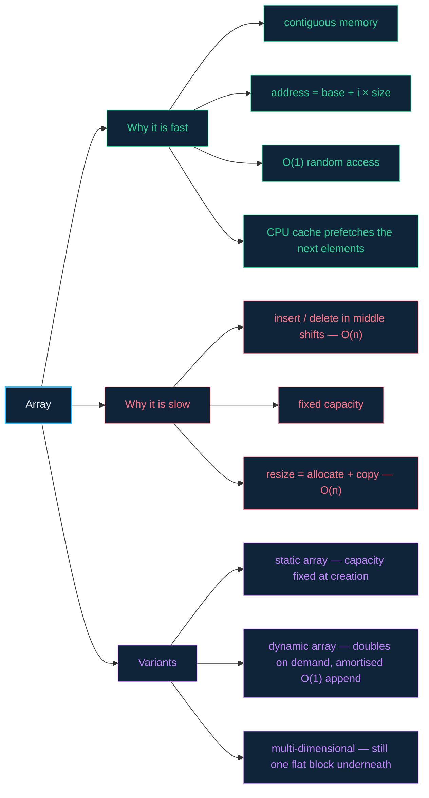

# 02 · Arrays — one unbroken block of memory

> **The analogy.** A street of numbered houses, all the same width, all in a row. To visit number 47 you do not walk past 46 doors — you know where it is, because the addresses are regular. But to squeeze a new house in between 12 and 13, every house from 13 upwards has to physically move.

---

## 🎞️ Animations

**Reading is free.**


**Inserting in the middle is not.**


**And when it runs out of room, it does not stretch — it is replaced.**


---

## 🧠 Mental model

| Street of numbered houses | Array |
|:--|:--|
| every house is the same width | every element is the same size in bytes |
| houses are consecutively numbered | indices are consecutive, starting at 0 |
| you compute where #47 is | `address(i) = base + i × itemSize` |
| inserting a house shifts the whole street | inserting at index `i` shifts `n − i` elements |
| the street has a fixed length | the array has a fixed **capacity** |
| building a longer street elsewhere and moving in | resizing = allocate double, copy, free |

The single fact **"one unbroken block"** generates every strength and every weakness below. Nothing else about an array matters as much.

---

## 📐 Blueprint



---

## 🗺️ Mindmap



---

## ⚙️ Operations

Each operation is shown twice: the **idea** as language-neutral pseudocode, then the **code** as a small Python function you can run. An array here is a fixed-size `store` plus a `length` — because that is what an array really is: a block of slots, only some of them in use.

**Read — the operation arrays exist for.**

```text
function get(A, i)
    if i < 0 or i ≥ A.length then error "out of bounds" end
    return memory[A.base + i × A.itemSize]      one multiply, one add
```

<!-- py:ops_arrays:get -->
```python
def get(store: list[Any], length: int, i: int) -> Any:
    """Read: the operation arrays exist for."""
    if not 0 <= i < length:
        raise IndexError("out of bounds")
    return store[i]                       # one address calculation, whatever i is
```
<!-- /py -->

`store[i]` compiles to that same multiply-and-add on the base address. That is the whole reason it is `O(1)` for any `i`.

**Insert at an index — the operation arrays are bad at.**

```text
function insertAt(A, i, value)
    if A.length = A.capacity then grow(A) end

    for j ← A.length down to i+1 do             walk backwards, or you
        A[j] ← A[j-1]                           overwrite what you have not moved yet
    end

    A[i] ← value
    A.length ← A.length + 1
```

<!-- py:ops_arrays:insert_at -->
```python
def insert_at(store: list[Any], length: int, i: int, value: Any) -> int:
    """Insert at an index. Returns the new length."""
    for j in range(length, i, -1):        # walk BACKWARDS: forwards would smear
        store[j] = store[j - 1]           # one value across the whole tail
    store[i] = value
    return length + 1                     # n - i elements moved: O(n)
```
<!-- /py -->

> **Why backwards?** Going forwards, `store[i]` would be copied into `store[i+1]`, then that same value into `store[i+2]` — smearing one value across the tail. `range(length, i, -1)` moves each element into a slot that has already been vacated.

**Delete at an index — the mirror image.**

```text
function deleteAt(A, i)
    for j ← i to A.length-2 do
        A[j] ← A[j+1]                           close the gap
    end
    A.length ← A.length - 1
```

<!-- py:ops_arrays:delete_at -->
```python
def delete_at(store: list[Any], length: int, i: int) -> int:
    """Delete at an index - the mirror image. Returns the new length."""
    for j in range(i, length - 1):
        store[j] = store[j + 1]           # close the gap
    store[length - 1] = None              # the vacated slot holds nothing
    return length - 1
```
<!-- /py -->

**Grow — why appending is *amortised* `O(1)`.**

```text
function grow(A)
    new ← allocate(A.capacity × 2)              doubling is the important part
    for j ← 0 to A.length-1 do
        new[j] ← A[j]
    end
    free(A.block)
    A.block ← new
    A.capacity ← A.capacity × 2
```

<!-- py:ops_arrays:grow -->
```python
def grow(store: list[Any], length: int) -> list[Any]:
    """Grow: why appending is *amortised* O(1). Returns the new store."""
    bigger = [None] * (len(store) * 2)    # doubling is the important part
    for j in range(length):
        bigger[j] = store[j]              # every element is copied: O(n)
    return bigger                         # the old block is now garbage
```
<!-- /py -->

**Append — puts the two together.**

```text
function append(A, value)
    if A.length = A.capacity then grow(A) end
    A[A.length] ← value
    A.length ← A.length + 1
```

<!-- py:ops_arrays:append -->
```python
def append(store: list[Any], length: int, value: Any) -> tuple[list[Any], int]:
    """Append, growing first if the block is full."""
    if length == len(store):
        store = grow(store, length)
    store[length] = value
    return store, length + 1
```
<!-- /py -->

> **Why doubling?** Growing by a *constant* (say +1) makes `n` appends cost `O(n²)` in total. Growing by a constant *factor* makes `n` appends cost `O(n)` in total — so each append averages `O(1)` even though one in every `n` is expensive.

Every Python function above is covered by [`examples/test_ops.py`](../examples/test_ops.py); a fuller class-based version lives in [`examples/linear.py`](../examples/linear.py).

---

## ⏱️ Complexity

| Operation | Best | Average | Worst | Why |
|:--|:--:|:--:|:--:|:--|
| access `A[i]` | O(1) | O(1) | O(1) | one address calculation, no search |
| search (unsorted) | O(1) | O(n) | O(n) | must look at each element |
| search (sorted) | O(1) | O(log n) | O(log n) | binary search — see [module 14](14-searching.md) |
| insert at end | O(1) | O(1)\* | O(n) | \*amortised; the worst case is the resize |
| insert at index | O(1) | O(n) | O(n) | shifts `n − i` elements right |
| delete at index | O(1) | O(n) | O(n) | shifts `n − i` elements left |

**Space:** `O(n)` for the data, plus whatever spare capacity the array is holding.

---

## ⚖️ Trade-offs

| ✅ Reach for an array when | ❌ Avoid an array when |
|:--|:--|
| you index by position constantly | you insert and delete in the middle constantly |
| the size is known, or grows only at the end | the size churns wildly and unpredictably |
| you iterate the whole thing often (cache loves this) | elements are huge and copying them is expensive |
| you need the absolute lowest memory overhead | you need `O(1)` insertion at arbitrary positions — use a [linked list](03-linked-lists.md) |
| you will binary search it | you look up by *key* rather than position — use a [hash table](07-hash-tables.md) |

> **In practice:** arrays are the default. The contiguous-memory cache advantage is so large that a "slow" `O(n)` array operation regularly beats a "fast" `O(1)` linked-list one for `n` in the thousands. Reach for something else when your profiler says to, not before.

---

## 🃏 Flashcards

<details><summary>Why is <code>A[i]</code> O(1) regardless of how large <code>i</code> is?</summary>

Because it is arithmetic, not searching: `base + i × itemSize`. One multiply and one add, whatever `i` is. This only works because every element is the same size and they are stored consecutively.
</details>

<details><summary>What exactly happens when a dynamic array is full and you append?</summary>

A new block of twice the capacity is allocated, every existing element is copied across, the old block is freed, and only then is the new element written. That single append is `O(n)`.
</details>

<details><summary>Why is appending still called O(1) then?</summary>

**Amortised** analysis. Doubling means the resizes get rarer exactly as fast as they get more expensive, so the total cost of `n` appends is `O(n)` — an average of `O(1)` each.
</details>

<details><summary>Why does <code>insertAt</code> loop backwards?</summary>

Forwards, you would copy `A[i]` into `A[i+1]`, then copy that same value into `A[i+2]`, and so on — smearing one value across the tail. Walking from the end backwards moves each element into a slot that has already been vacated.
</details>

<details><summary>What is the difference between length and capacity?</summary>

**Length** is how many elements you have put in. **Capacity** is how many the currently allocated block could hold. `length ≤ capacity`, and the gap is the spare room that makes the next few appends cheap.
</details>

<details><summary>A 2D array — is it really two-dimensional in memory?</summary>

No. It is one flat block, with the rows laid end to end (row-major) or the columns (column-major). `grid[r][c]` becomes `base + (r × columns + c) × itemSize`. This is why iterating a 2D array along the wrong axis is measurably slower — you defeat the cache.
</details>

---

## ❓ Quiz

**1.** You insert a value at index 0 of a 1,000,000-element array. How many elements move?

<details><summary>Answer</summary>

**All 1,000,000.** Inserting at index `i` shifts `n − i` elements, and `i = 0` shifts every one of them. Index 0 is the worst possible insertion point. Inserting at the *end* moves none, which is why appending is the only cheap insertion.
</details>

**2.** An array holds 4 items in a capacity of 4. You append 5 more, one at a time, with doubling. How many resizes happen, and how many elements are copied?

<details><summary>Answer</summary>

**Two resizes, 12 elements copied.** The 5th append finds the array full and grows 4 → 8, copying 4 elements. Appends 6, 7 and 8 fit in the spare room for free. The 9th append grows 8 → 16, copying 8 elements. Total: 4 + 8 = 12 copies spread across 5 appends — that averaging is exactly what "amortised O(1)" means.
</details>

**3.** Why can binary search work on an array but not on a linked list?

<details><summary>Answer</summary>

Binary search needs to jump straight to the middle element. An array computes that address in `O(1)`. A linked list has no address arithmetic — reaching the middle costs `O(n)` hops, which destroys the `O(log n)` benefit entirely.
</details>

**4.** You need a collection where you constantly delete from the front. Is an array a good choice?

<details><summary>Answer</summary>

**No** — every deletion from the front shifts the entire remainder, making it `O(n)` each time. Use a [queue](06-queues.md) backed by a linked list, or a **circular buffer**, which gets `O(1)` at both ends by moving the *indices* instead of the data.
</details>

---

⬅️ [01 · Foundations](01-foundations.md) · [🏠 Index](../README.md) · [03 · Linked lists](03-linked-lists.md) ➡️
