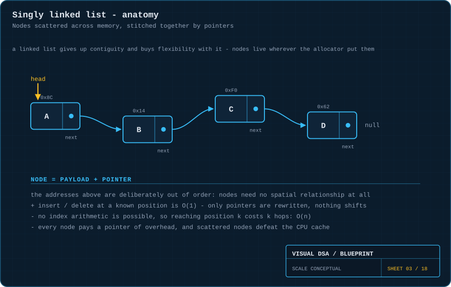
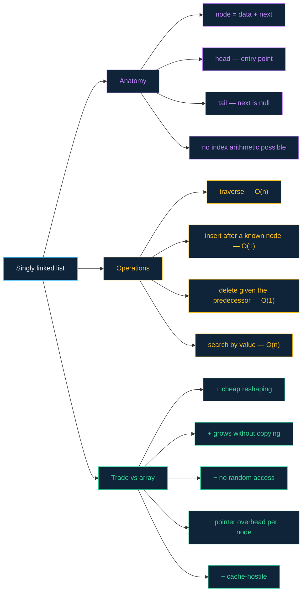

# 03 · Linked lists — nodes that only know their neighbour

> **The analogy.** A treasure hunt. Each clue holds one piece of treasure and the location of the next clue. You cannot skip to the fifth clue — nobody wrote down where it is except the fourth clue. But slipping a new clue into the middle of the hunt is trivial: rewrite two notes, and nothing else in the world has to move.

---

## 🎞️ Animations

**Reaching position `k` costs `k` hops. There is no shortcut.**


**Insertion is two pointer writes — nothing shifts.**


**Deletion does not erase anything; it routes around it.**


---

## 🧠 Mental model

| Treasure hunt | Linked list |
|:--|:--|
| a clue | a **node** |
| the treasure on the clue | the node's **data** |
| the location of the next clue | the node's **next** pointer |
| the starting clue you were handed | **head** |
| "this is the last clue" | `next = null` |
| clues hidden all over town | nodes scattered anywhere in memory |
| adding a clue = rewrite two notes | insertion = rewrite two pointers |

The defining property is the **opposite** of an array's: a linked list gives up contiguity, and therefore gives up address arithmetic. Everything follows from that trade.

---

## 📐 Blueprint



Look at the memory addresses in the drawing: `0x8C`, `0x14`, `0xF0`, `0x62`. They are deliberately out of order. Nodes have **no spatial relationship whatsoever** — the pointers are the only thing holding the list together.

---

## 🗺️ Mindmap



---

## ⚙️ Operations

A node is a payload plus a pointer. Nothing else:

<!-- py:nodes:Node -->
```python
class Node:
    """A singly linked list node: one payload, one pointer."""
    __slots__ = ("value", "next")

    def __init__(self, value: Any, next: Optional["Node"] = None) -> None:
        self.value = value
        self.next = next
```
<!-- /py -->

**Traverse — the operation you cannot avoid.**

```text
function traverse(head)
    current ← head
    while current ≠ null do
        visit(current.data)
        current ← current.next          the only way to move
    end
```

<!-- py:ops_linked_list:traverse -->
```python
def traverse(head: Optional[Node]) -> list[Any]:
    """Following `next` is the only way to move. O(n)."""
    out = []
    current = head
    while current is not None:
        out.append(current.value)
        current = current.next            # the only way forward
    return out
```
<!-- /py -->

**Get the k-th element — deliberately shown, because it is the weakness.**

```text
function get(head, k)
    current ← head
    for i ← 0 to k-1 do
        if current = null then error "out of range" end
        current ← current.next
    end
    return current.data                 k hops. No arithmetic can shorten this.
```

<!-- py:ops_linked_list:get -->
```python
def get(head: Optional[Node], k: int) -> Any:
    """Reach position k. There is no address arithmetic here - only k hops."""
    current = head
    for _ in range(k):
        if current is None:
            raise IndexError("out of range")
        current = current.next
    if current is None:
        raise IndexError("out of range")
    return current.value                  # k hops: O(n), never O(1)
```
<!-- /py -->

There is no formula that jumps to position `k`. This is the single biggest practical difference from an array.

**Insert after a node you already hold — the operation you use a linked list for.**

```text
function insertAfter(node, value)
    fresh ← new Node(value)
    fresh.next ← node.next              1. the new node adopts the rest of the list
    node.next  ← fresh                  2. the predecessor adopts the new node
                                        two writes, no shifting, O(1)
```

<!-- py:ops_linked_list:insert_after -->
```python
def insert_after(node: Node, value: Any) -> Node:
    """Two writes, and nothing shifts. O(1) once you hold `node`."""
    fresh = Node(value)
    fresh.next = node.next                # 1. the new node adopts the rest
    node.next = fresh                     # 2. the predecessor adopts the new node
    return fresh                          # reverse these two and the tail is lost
```
<!-- /py -->

> **Order matters.** Do step 2 first and you have overwritten `node.next` — the rest of the list is now unreachable and leaked.

**Insert at the head — the cheapest insertion of all.**

```text
function prepend(head, value)
    fresh ← new Node(value)
    fresh.next ← head
    return fresh                        the new head
```

<!-- py:ops_linked_list:prepend -->
```python
def prepend(head: Optional[Node], value: Any) -> Node:
    """The cheapest insertion there is. Returns the new head."""
    return Node(value, head)
```
<!-- /py -->

**Delete — the node is never erased, only bypassed.**

```text
function deleteAfter(node)
    victim ← node.next
    if victim = null then return end
    node.next ← victim.next             route around it
    free(victim)                        the node is now unreachable
```

<!-- py:ops_linked_list:delete_after -->
```python
def delete_after(node: Node) -> Optional[Any]:
    """Nothing is erased - the node is routed around and becomes unreachable."""
    victim = node.next
    if victim is None:
        return None
    node.next = victim.next               # route around it
    return victim.value
```
<!-- /py -->

**Reverse — the classic interview question, and a genuine test of the model.**

```text
function reverse(head)
    previous ← null
    current  ← head
    while current ≠ null do
        following ← current.next        save it, you are about to destroy it
        current.next ← previous         flip the arrow
        previous ← current              shuffle both pointers forward
        current  ← following
    end
    return previous                     the old tail is the new head
```

<!-- py:ops_linked_list:reverse -->
```python
def reverse(head: Optional[Node]) -> Optional[Node]:
    """Three pointers, because flipping a link destroys the way onwards."""
    previous, current = None, head
    while current is not None:
        following = current.next          # save it before you overwrite it
        current.next = previous           # flip the arrow
        previous, current = current, following
    return previous                       # the old tail is the new head
```
<!-- /py -->

**Detect a cycle — Floyd's tortoise and hare.**

```text
function hasCycle(head)
    slow ← head
    fast ← head
    while fast ≠ null and fast.next ≠ null do
        slow ← slow.next                one step
        fast ← fast.next.next           two steps
        if slow = fast then return true end
    end
    return false                        they can only meet inside a loop
```

<!-- py:ops_linked_list:has_cycle -->
```python
def has_cycle(head: Optional[Node]) -> bool:
    """Floyd's tortoise and hare. O(n) time, O(1) space."""
    slow = fast = head
    while fast is not None and fast.next is not None:
        slow = slow.next                  # one step
        fast = fast.next.next             # two steps
        if slow is fast:
            return True                   # they can only meet inside a loop
    return False
```
<!-- /py -->

Every Python function above is covered by [`examples/test_ops.py`](../examples/test_ops.py).

---

## ⏱️ Complexity

| Operation | Best | Average | Worst | Why |
|:--|:--:|:--:|:--:|:--|
| access k-th | O(1) | O(n) | O(n) | `k` hops; no address arithmetic exists |
| search by value | O(1) | O(n) | O(n) | walk until it matches |
| insert at head | O(1) | O(1) | O(1) | two writes, always |
| insert after a held node | O(1) | O(1) | O(1) | two writes, always |
| insert at position `k` | O(1) | O(n) | O(n) | the `O(n)` is the **walk**, not the insert |
| delete a held node's successor | O(1) | O(1) | O(1) | one write |
| delete by value | O(1) | O(n) | O(n) | you must find it first |

**Space:** `O(n)`, plus one pointer of overhead **per node** — which on a list of small values can double or triple the memory an array would use.

> **The distinction that trips people up:** "insertion is `O(1)`" is true *once you are standing at the right node*. Getting there is `O(n)`. A linked list is fast at inserting, not at finding where to insert.

---

## ⚖️ Trade-offs

| ✅ Reach for a linked list when | ❌ Avoid a linked list when |
|:--|:--|
| you insert and delete constantly, at positions you already hold | you index by position (`list[500]`) |
| the collection grows unpredictably and copying is expensive | you iterate hot loops — the cache misses are brutal |
| you are building a [stack](05-stacks.md) or [queue](06-queues.md) | elements are small — the pointer overhead dominates |
| you need to splice whole sublists in `O(1)` | you need to binary search |
| you cannot tolerate the latency spike of an array resize | memory is tight |

---

## 🃏 Flashcards

<details><summary>Why can a linked list not do binary search?</summary>

Binary search needs `O(1)` access to the middle element. A linked list can only reach the middle by walking `n/2` nodes. You would spend `O(n)` per "halving", turning `O(log n)` into `O(n log n)` — worse than just scanning.
</details>

<details><summary>In <code>insertAfter</code>, why must <code>fresh.next ← node.next</code> come first?</summary>

Because `node.next` is the only reference to the rest of the list. Overwrite it first and the tail is orphaned and leaked. Always attach the new node to the future before you attach the past to the new node.
</details>

<details><summary>Deleting a node given only a pointer to it (not its predecessor) — possible?</summary>

Not properly, in a singly linked list — you cannot reach the predecessor to update its `next`. The classic trick is to copy the *successor's* data into the node and delete the successor instead. It fails on the tail node. A [doubly linked list](04-doubly-and-circular-lists.md) solves this cleanly.
</details>

<details><summary>Why is a linked list "cache-hostile"?</summary>

The CPU loads memory in contiguous cache lines and prefetches ahead. An array scan gets several elements per fetch, essentially free. A linked list node can be anywhere, so nearly every hop is a cache miss — often 100× slower than a hit. This is why arrays frequently beat linked lists in practice despite worse Big-O.
</details>

<details><summary>What is a sentinel (dummy) head node and why use one?</summary>

An extra node before the real first element, holding no data. It means the head is never `null` and every real node has a predecessor — so insert and delete need no special case for the front. It costs one node and removes a whole class of bugs.
</details>

<details><summary>How do you detect a cycle in a linked list?</summary>

**Floyd's tortoise and hare**: advance one pointer by 1 node and another by 2. If they ever meet, there is a cycle; if the fast one reaches `null`, there is not. `O(n)` time, `O(1)` space.
</details>

---

## ❓ Quiz

**1.** Getting the 500th element of a 1000-node linked list costs what?

<details><summary>Answer</summary>

**`O(n)` — 500 hops.** There is no formula that jumps there. This is the single biggest practical difference from an array.
</details>

**2.** You have a pointer to a node in the middle of a singly linked list and want to insert after it. Cost?

<details><summary>Answer</summary>

**`O(1)`.** Two pointer writes. Nothing shifts, nothing is copied, and the rest of the list is untouched — the exact opposite of an array insertion.
</details>

**3.** Why does `reverse` need three pointers?

<details><summary>Answer</summary>

Because flipping `current.next` to point backwards destroys the only reference to the rest of the list. `following` saves it before the flip, `previous` remembers where backwards *is*, and `current` is where you are. Drop any one and you lose half the list.
</details>

**4.** You are storing 1,000,000 single bytes. Array or linked list?

<details><summary>Answer</summary>

**Array**, decisively. The list would spend 8 bytes of pointer for every 1 byte of data — roughly 9 MB to store 1 MB — and every traversal would be a parade of cache misses. Pointer overhead only makes sense when the payload is large relative to a pointer.
</details>

---

⬅️ [02 · Arrays](02-arrays.md) · [🏠 Index](../README.md) · [04 · Doubly & circular lists](04-doubly-and-circular-lists.md) ➡️
