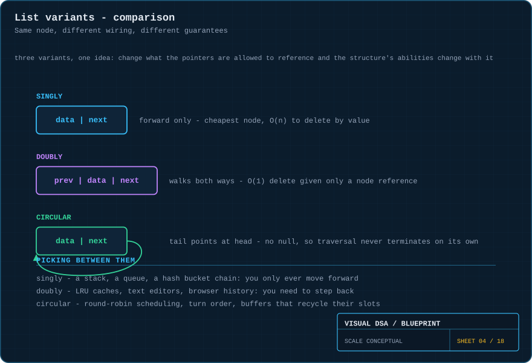
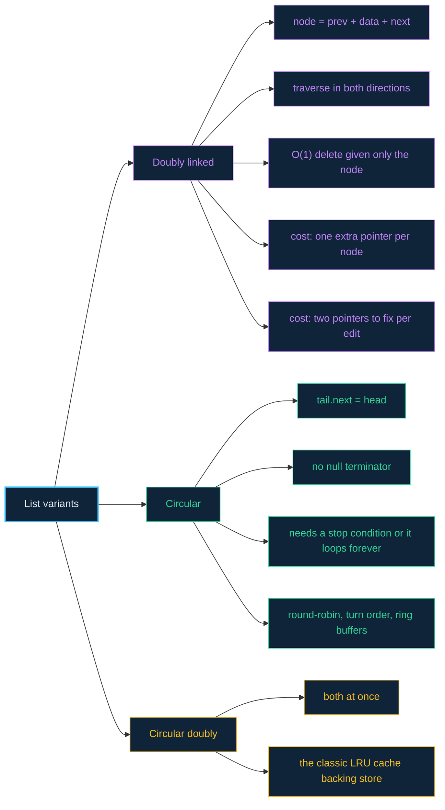

# 04 · Doubly & circular lists — changing what the pointers may reference

> **The analogy.** A singly linked list is a one-way street. A **doubly** linked list adds the return lane: every node knows who came before it as well as who comes after. A **circular** list removes the dead end entirely — the last node points back at the first, so the street becomes a roundabout that you can drive forever.

---

## 🎞️ Animations

**Doubly linked: the cursor walks forward, then walks back.**


**Circular: no null, no end — the token just keeps going round.**


---

## 🧠 Mental model

| Situation | The variant that fits |
|:--|:--|
| a conga line — you only ever go forward | **singly** linked |
| a train carriage — you can walk to either end | **doubly** linked |
| a roundabout — there is no last exit | **circular** |
| browser history (back *and* forward) | doubly |
| whose turn is it next, forever | circular |
| an LRU cache evicting from the tail | doubly (needs `O(1)` removal by reference) |

---

## 📐 Blueprint



---

## 🗺️ Mindmap



---

## ⚙️ Operations

**Doubly linked — insert after a node. Four writes instead of two.**

```text
function insertAfter(node, value)
    fresh ← new Node(value)

    fresh.next ← node.next
    fresh.prev ← node
    if node.next ≠ null then
        node.next.prev ← fresh          the successor must learn about it too
    end
    node.next ← fresh
```

**Doubly linked — delete, given nothing but the node itself.**

```text
function delete(node)
    if node.prev ≠ null then
        node.prev.next ← node.next
    else
        head ← node.next                it was the head
    end

    if node.next ≠ null then
        node.next.prev ← node.prev
    else
        tail ← node.prev                it was the tail
    end

    free(node)                          O(1) — no search, no predecessor hunt
```

> **This is the whole reason doubly linked lists exist.** In a singly linked list, deleting a node you hold a reference to requires finding its predecessor: `O(n)`. Here it is `O(1)`, which is what makes an LRU cache work.

**Circular — traverse, with the stop condition that matters.**

```text
function traverseOnce(head)
    if head = null then return end

    current ← head
    repeat
        visit(current.data)
        current ← current.next
    until current = head                NOT "until current = null" — there is no null
```

> **The classic bug:** writing `while current ≠ null` on a circular list. It never terminates. The terminator is *"I am back where I started"*, not *"I have run out of nodes"*.

**Circular — round-robin scheduling, the canonical use.**

```text
function nextTurn(currentPlayer)
    return currentPlayer.next           always valid, never null, wraps for free
```

---

## ⏱️ Complexity

| Operation | Singly | Doubly | Note |
|:--|:--:|:--:|:--|
| traverse forward | O(n) | O(n) | identical |
| traverse backward | O(n²) or impossible | **O(n)** | singly must restart from the head each step |
| insert after a held node | O(1) | O(1) | doubly does 4 writes instead of 2 |
| delete a held node | **O(n)** | **O(1)** | the headline difference |
| delete a held node's successor | O(1) | O(1) | identical |
| memory per node | 1 pointer | **2 pointers** | the price of the return lane |

Circular lists have the same costs as their non-circular equivalent; what changes is that the tail is reachable from the head in `O(n)` and there is no end-of-list special case.

---

## ⚖️ Trade-offs

| ✅ Use **doubly** when | ❌ Skip doubly when |
|:--|:--|
| you delete nodes you already hold references to | you only ever push and pop one end — use singly |
| you need to iterate backwards | memory per node is tight |
| you are building an LRU cache or a text editor buffer | your payloads are tiny (2 pointers may exceed the data) |

| ✅ Use **circular** when | ❌ Skip circular when |
|:--|:--|
| the collection genuinely has no beginning or end | you need a clear "the list is finished" signal |
| you cycle turns, slots or buffers indefinitely | your traversal code assumes `null` termination |
| you want a ring buffer with no wraparound branching | debugging matters more than elegance — a cycle bug loops forever |

---

## 🃏 Flashcards

<details><summary>What does the extra <code>prev</code> pointer actually buy you?</summary>

`O(1)` deletion given only a node reference, and `O(n)` backward traversal. Both are impossible-or-expensive in a singly linked list. You pay one pointer per node and one extra write per edit.
</details>

<details><summary>Why is deleting a held node O(n) in a singly linked list?</summary>

To unlink it you must set `predecessor.next`, and the only way to find the predecessor is to walk from the head until you find the node whose `next` is your victim.
</details>

<details><summary>What terminates a circular list traversal?</summary>

Returning to the node you started at: `until current = head`. There is no `null` anywhere in a circular list, so the usual condition never fires.
</details>

<details><summary>How does an LRU cache use a circular doubly linked list?</summary>

A hash map points at nodes; the list holds usage order. On a hit, the node is unlinked and re-inserted at the front — both `O(1)` because of `prev`. On eviction, the tail is removed, also `O(1)`. Neither works without the backward pointer.
</details>

<details><summary>In a doubly linked list, how many pointers change when you delete a middle node?</summary>

**Two**: the predecessor's `next` and the successor's `prev`. Both endpoints need extra care — the node may be the head, the tail, or both.
</details>

---

## ❓ Quiz

**1.** You are given a pointer to a node in the middle of a list and asked to delete it in `O(1)`. Which variant do you need?

<details><summary>Answer</summary>

**Doubly linked.** With `prev` you can reach both neighbours immediately. In a singly linked list you would have to walk from the head to find the predecessor — `O(n)`.
</details>

**2.** What happens if you run `while current ≠ null` over a circular list?

<details><summary>Answer</summary>

**It never terminates.** No node has `next = null`, so the loop cycles forever. Circular lists must terminate on *"back at the start"*, and that is the number one bug when converting a linear list to a circular one.
</details>

**3.** You store 1,000,000 nodes, each holding a 4-byte integer, in a doubly linked list on a 64-bit machine. How much of that memory is your data?

<details><summary>Answer</summary>

Roughly **20%** — 4 bytes of payload against 16 bytes of pointers per node (plus allocator overhead). Four fifths of the memory is bookkeeping. An array would use 4 MB where this uses 20 MB or more.
</details>

**4.** Which variant would you choose for a music player's "repeat all" queue?

<details><summary>Answer</summary>

**Circular** — the playlist genuinely has no end, so `next` at the last track should naturally be the first. Make it **circular doubly** if you also want a "previous track" button in `O(1)`.
</details>

---

⬅️ [03 · Linked lists](03-linked-lists.md) · [🏠 Index](../README.md) · [05 · Stacks](05-stacks.md) ➡️
