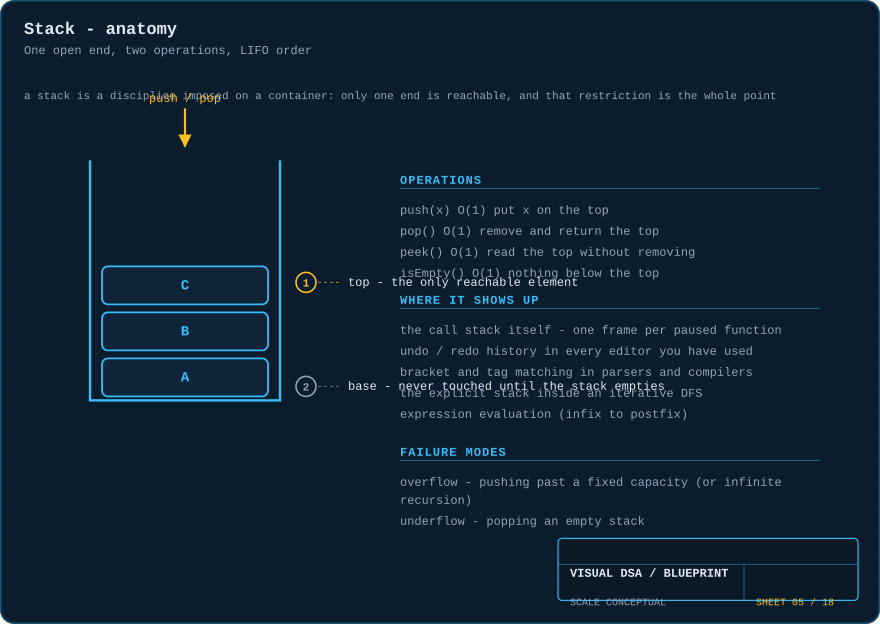
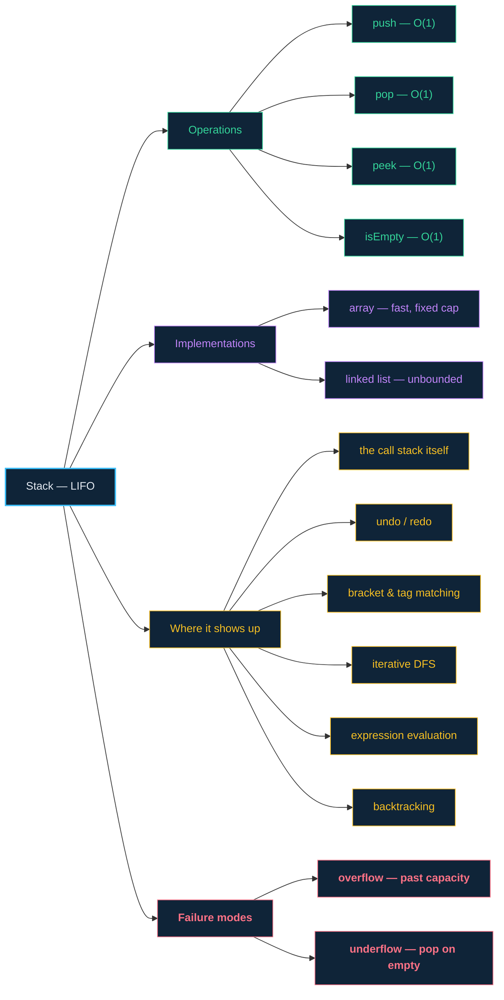

# 05 · Stacks — one open end, and that restriction is the feature

> **The analogy.** A pile of plates in a canteen. You can only take the top one, and you can only put a new one on top. Nobody reaches into the middle. It sounds like a limitation, and it is — but it is exactly the limitation that makes "undo" and "go back" work.

---

## 🎞️ Animation


Watch the **top** pointer: it is the only thing the stack ever tracks. Everything below it is inert.

---

## 🧠 Mental model

| Pile of plates | Stack |
|:--|:--|
| put a plate on top | `push(x)` |
| take the top plate | `pop()` |
| look at the top without taking it | `peek()` |
| the pile is empty | `isEmpty()` |
| last plate on is the first plate off | **LIFO** — Last In, First Out |
| the pile is too tall for the cupboard | **stack overflow** |
| taking a plate from an empty pile | **stack underflow** |

**LIFO is a memory of order.** Every time you need to remember *"what was I doing before this?"*, you want a stack — because that question is exactly what a stack answers in `O(1)`.

---

## 📐 Blueprint



---

## 🗺️ Mindmap



---

## ⚙️ Operations

Each operation is shown twice: the **idea** as pseudocode, then the **code** as a runnable Python function.

**Push — put a value on the top.**

```text
function push(S, value)
    if S.top = S.capacity - 1 then error "overflow" end
    S.top ← S.top + 1
    S.items[S.top] ← value
```

<!-- py:ops_stack:push -->
```python
def push(stack: list[Any], value: Any) -> None:
    """Put a value on the top. O(1)."""
    stack.append(value)
```
<!-- /py -->

**Pop — remove and return the top.**

```text
function pop(S)
    if S.top = -1 then error "underflow" end
    value ← S.items[S.top]
    S.top ← S.top - 1                   the value is not erased, just unreachable
    return value
```

<!-- py:ops_stack:pop -->
```python
def pop(stack: list[Any]) -> Any:
    """Remove and return the top. O(1)."""
    if not stack:
        raise IndexError("underflow: pop from an empty stack")
    return stack.pop()                    # the value is not erased, just unreachable
```
<!-- /py -->

In the pseudocode `top` starts at `-1` for an empty stack — with 0-based indexing that means "no valid index yet". Python's `list` tracks that for us.

**Peek — read the top without removing it.**

```text
function peek(S)
    if S.top = -1 then error "empty" end
    return S.items[S.top]
```

<!-- py:ops_stack:peek -->
```python
def peek(stack: list[Any]) -> Any:
    """Read the top without removing it. O(1)."""
    if not stack:
        raise IndexError("empty")
    return stack[-1]
```
<!-- /py -->

**isEmpty.**

```text
function isEmpty(S)
    return S.top = -1
```

<!-- py:ops_stack:is_empty -->
```python
def is_empty(stack: list[Any]) -> bool:
    return not stack
```
<!-- /py -->

**The canonical application — balanced bracket checking.**

```text
function isBalanced(text)
    S ← empty stack

    for each ch in text do
        if ch is one of ( [ { then
            push(S, ch)
        else if ch is one of ) ] } then
            if isEmpty(S) then return false end         a closer with nothing open
            if not matches(pop(S), ch) then return false end
        end
    end

    return isEmpty(S)                   anything left open means unbalanced
```

<!-- py:ops_stack:is_balanced -->
```python
def is_balanced(text: str) -> bool:
    """The canonical application: every opener is a note saying 'close me'.

    The stack guarantees they close in the reverse of the order they opened,
    which is exactly what nesting means.
    """
    stack: list[str] = []
    for ch in text:
        if ch in "([{":
            stack.append(ch)              # remember to close this
        elif ch in ")]}":
            if not stack:
                return False              # a closer with nothing open
            if stack.pop() != PAIRS[ch]:
                return False              # closed in the wrong order
    return not stack                      # anything left open is unbalanced
```
<!-- /py -->

Every opener you push is a note saying *"remember to close this"*. The stack guarantees you close them in the reverse of the order you opened them — which is precisely what nesting means.

> **A linked-list-backed stack** is the same two operations without a capacity limit: `push` prepends to the head, `pop` advances it. Both stay `O(1)`.

Every Python function above is covered by [`examples/test_ops.py`](../examples/test_ops.py).

---

## ⏱️ Complexity

| Operation | Time | Space | Why |
|:--|:--:|:--:|:--|
| `push` | O(1) | — | write at `top`, increment |
| `pop` | O(1) | — | read at `top`, decrement |
| `peek` | O(1) | — | one read |
| `isEmpty` | O(1) | — | one comparison |
| search for a value | O(n) | — | you must pop everything above it |
| the whole structure | — | O(n) | plus pointers if linked-list-backed |

Array-backed `push` is `O(1)` **amortised** if the array grows dynamically — the same doubling argument as [module 02](02-arrays.md).

---

## ⚖️ Trade-offs

| ✅ Reach for a stack when | ❌ Avoid a stack when |
|:--|:--|
| you need to remember what you were doing before | you need the *oldest* item — that is a [queue](06-queues.md) |
| the natural order is reverse of arrival | you need to search or index the contents |
| you are undoing, backtracking or unwinding | fairness matters — a stack starves the earliest arrivals |
| you want to convert recursion into a loop | you need to inspect the middle |

> **The recursion connection.** Every recursive function is already using a stack — the call stack. Converting recursion to iteration means building that stack yourself, explicitly. See [module 16](16-recursion-and-backtracking.md).

---

## 🃏 Flashcards

<details><summary>What does LIFO mean and why is it useful?</summary>

**Last In, First Out** — the most recent addition is the first removal. It is useful because it is a memory of nesting: the last thing you started is the first thing you must finish.
</details>

<details><summary>Array-backed or linked-list-backed stack — which and when?</summary>

**Array**: faster (contiguous, cache-friendly), lower overhead, but has a capacity that must be grown. **Linked list**: no capacity limit and no resize spike, but a pointer per node and cache misses. Arrays win by default; use a list when a latency spike from resizing is unacceptable.
</details>

<details><summary>Why does <code>pop</code> not erase the value?</summary>

Because nothing can reach it any more — `top` has moved below it, and the next `push` will overwrite it. Erasing would be wasted work. (In garbage-collected languages you sometimes *do* null it out, so the collector can free the referenced object.)
</details>

<details><summary>What causes a "stack overflow" error in a real program?</summary>

Recursion without a working base case, or recursion too deep for the fixed-size call stack. Each pending call is a real stack frame in memory; enough of them and you run off the end of the allocated stack.
</details>

<details><summary>How do you check balanced brackets with a stack?</summary>

Push every opener. On a closer, pop and check it matches. If you pop an empty stack, or the stack is non-empty at the end, it is unbalanced.
</details>

<details><summary>Can you implement a queue using two stacks?</summary>

Yes. Push onto stack A. To dequeue, if stack B is empty, pop everything from A into B (which reverses the order), then pop B. Amortised `O(1)` per operation, because each element moves between stacks at most once.
</details>

---

## ❓ Quiz

**1.** You push 1, 2, 3, then pop twice. What is left, and what came out?

<details><summary>Answer</summary>

Out came **3 then 2**; **1** remains. Last in, first out — the pops are the exact reverse of the pushes.
</details>

**2.** Why is a stack the right structure for undo, rather than a queue?

<details><summary>Answer</summary>

Undo must reverse the **most recent** action first. A queue would undo your oldest action first, which is nonsense. LIFO *is* the semantics of undo.
</details>

**3.** `pop()` on an empty stack — what is that called and how do you prevent it?

<details><summary>Answer</summary>

**Underflow.** Prevent it by checking `isEmpty()` before every pop, or by having `pop` return a sentinel / raise a handled error. It is the single most common stack bug.
</details>

**4.** DFS can be written recursively or with an explicit stack. What is actually different between the two?

<details><summary>Answer</summary>

**Only who owns the stack.** Recursion uses the call stack (limited size, managed for you); the iterative version uses a heap-allocated stack (grows as large as memory allows). The traversal order and the complexity are identical — but the iterative one will not overflow on a deep graph.
</details>

---

⬅️ [04 · Doubly & circular lists](04-doubly-and-circular-lists.md) · [🏠 Index](../README.md) · [06 · Queues](06-queues.md) ➡️
