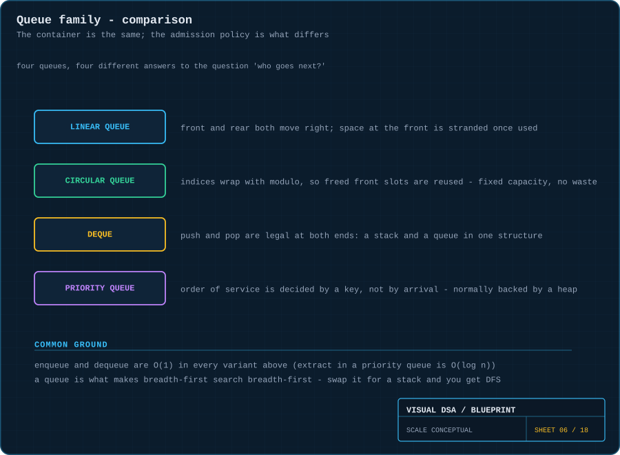
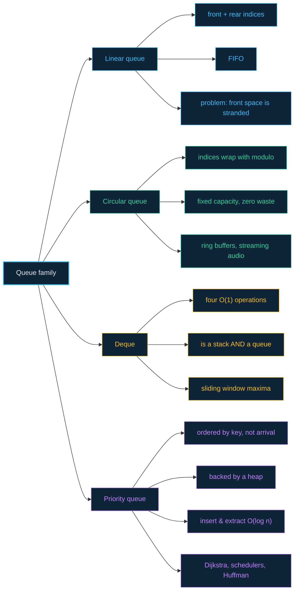

# 06 · Queues — fairness, and three ways to bend it

> **The analogy.** The line at a supermarket checkout. You join at the back, you are served from the front, and nobody who arrived after you gets served before you. That is a **queue**. A **circular queue** is the same line drawn on a roundabout so the space at the front gets reused. A **deque** lets you join or leave at either end. A **priority queue** is a hospital emergency room, where arrival order stops mattering entirely.

---

## 🎞️ Animations

**The plain queue: served at the front, joined at the rear.**


**The circular queue: the rear index wraps to 0 and reuses freed slots.**


**The deque: all four operations, both ends.**


**The priority queue: arrival order is discarded; urgency decides.**


---

## 🧠 Mental model

| Real world | Structure | Rule |
|:--|:--|:--|
| supermarket checkout | **queue** | FIFO — First In, First Out |
| a ring of parking bays, reused as they empty | **circular queue** | FIFO with wraparound and fixed capacity |
| a train carriage with doors at both ends | **deque** | push/pop at front *and* rear |
| hospital triage | **priority queue** | lowest key first, arrival order irrelevant |

---

## 📐 Blueprint



---

## 🗺️ Mindmap



---

## ⚙️ Operations

**Linear queue — and the flaw that motivates the circular one.**

```text
function enqueue(Q, value)
    if Q.rear = Q.capacity - 1 then error "full" end
    Q.rear ← Q.rear + 1
    Q.items[Q.rear] ← value

function dequeue(Q)
    if Q.front > Q.rear then error "empty" end
    value ← Q.items[Q.front]
    Q.front ← Q.front + 1               the slot at the old front is now stranded
    return value
```

> **The flaw:** after five enqueues and five dequeues on a capacity-5 queue, `rear` is at the end and the queue reports "full" — while every slot is actually free. The indices marched off the end and never came back.

**Circular queue — the fix is one operator.**

```text
function enqueue(Q, value)
    if Q.count = Q.capacity then error "full" end
    Q.rear ← (Q.rear + 1) mod Q.capacity        ← the whole fix
    Q.items[Q.rear] ← value
    Q.count ← Q.count + 1

function dequeue(Q)
    if Q.count = 0 then error "empty" end
    value ← Q.items[Q.front]
    Q.front ← (Q.front + 1) mod Q.capacity
    Q.count ← Q.count - 1
    return value
```

> **Why keep a `count`?** With wraparound, `front = rear` is ambiguous — it means both "empty" and "full". Tracking `count` (or deliberately leaving one slot unused) disambiguates it.

**Deque — four operations, all `O(1)`.**

```text
function pushFront(D, value)   ...      insert before D.front
function pushBack(D, value)    ...      insert after D.rear
function popFront(D)           ...      remove and return D.front
function popBack(D)            ...      remove and return D.rear
```

Use `pushBack` + `popFront` and you have a queue. Use `pushBack` + `popBack` and you have a stack. A deque is a superset of both.

**Priority queue — the interface, backed by a [heap](09-heaps.md).**

```text
function insert(PQ, value, priority)
    add to the heap, then sift up                O(log n)

function extractMin(PQ)
    take the root, move the last leaf to the root, sift down     O(log n)

function peek(PQ)
    return the root                              O(1)
```

---

<!-- python:examples/restricted.py:CircularQueue,Deque,PriorityQueue -->
<details><summary><b>🐍 Python implementation</b></summary>

`(i + 1) % capacity` is the entire difference between a linear and a circular queue:

```python
class CircularQueue:
    """Fixed capacity. `(i + 1) % capacity` is the whole difference from linear."""

    def __init__(self, capacity: int) -> None:
        if capacity < 1:
            raise ValueError("capacity must be positive")
        self.capacity = capacity
        self._slots: list[Any] = [None] * capacity
        self._front = 0
        self._rear = -1
        self._count = 0                      # front == rear is ambiguous without this

    def enqueue(self, value: Any) -> None:
        if self._count == self.capacity:
            raise OverflowError("full")
        self._rear = (self._rear + 1) % self.capacity
        self._slots[self._rear] = value
        self._count += 1

    def dequeue(self) -> Any:
        if self._count == 0:
            raise IndexError("empty")
        value = self._slots[self._front]
        self._slots[self._front] = None
        self._front = (self._front + 1) % self.capacity
        self._count -= 1
        return value

    def __len__(self) -> int:
        return self._count

    @property
    def is_full(self) -> bool:
        return self._count == self.capacity


class Deque:
    """A stack and a queue at once: all four operations are O(1)."""

    def __init__(self) -> None:
        self._items: list[Any] = []

    def push_front(self, value: Any) -> None:
        self._items.insert(0, value)

    def push_back(self, value: Any) -> None:
        self._items.append(value)

    def pop_front(self) -> Any:
        if not self._items:
            raise IndexError("empty")
        return self._items.pop(0)

    def pop_back(self) -> Any:
        if not self._items:
            raise IndexError("empty")
        return self._items.pop()

    def __len__(self) -> int:
        return len(self._items)


class PriorityQueue:
    """Order of service is decided by a key, not by arrival.

    The counter breaks ties by arrival order and keeps unorderable payloads
    from ever being compared.
    """

    def __init__(self) -> None:
        self._heap: list[tuple[Any, int, Any]] = []
        self._tie = itertools.count()

    def insert(self, value: Any, priority: Any) -> None:
        heapq.heappush(self._heap, (priority, next(self._tie), value))   # O(log n)

    def extract_min(self) -> Any:
        if not self._heap:
            raise IndexError("empty")
        return heapq.heappop(self._heap)[2]                              # O(log n)

    def peek(self) -> Any:
        if not self._heap:
            raise IndexError("empty")
        return self._heap[0][2]                                          # O(1)

    def __len__(self) -> int:
        return len(self._heap)
```

Tested in [`examples/test_examples.py`](../examples/test_examples.py). Run the suite with `python3 -m unittest discover -s examples -t .`
</details>
<!-- /python -->

---

## ⏱️ Complexity

| Operation | Linear | Circular | Deque | Priority |
|:--|:--:|:--:|:--:|:--:|
| enqueue / push back | O(1) | O(1) | O(1) | **O(log n)** |
| dequeue / pop front | O(1) | O(1) | O(1) | **O(log n)** |
| push front | — | — | O(1) | — |
| pop back | — | — | O(1) | — |
| peek | O(1) | O(1) | O(1) | O(1) |
| search | O(n) | O(n) | O(n) | O(n) |
| space | O(n) | O(capacity) | O(n) | O(n) |

The priority queue is the odd one out: it pays `O(log n)` on every insert and removal to keep the ordering invariant that lets `peek` stay `O(1)`.

---

## ⚖️ Trade-offs

| ✅ Reach for a queue when | ❌ Avoid a queue when |
|:--|:--|
| processing order must match arrival order | the newest item matters most — use a [stack](05-stacks.md) |
| you are doing [BFS](13-graphs.md) — the queue *is* the algorithm | you need to index or search the contents |
| you are buffering between a fast producer and a slow consumer | some items genuinely are more urgent — use a priority queue |
| fairness or starvation-freedom is a requirement | you need `O(1)` access to the middle |

**Picking within the family:**

- Fixed memory budget, steady throughput → **circular queue** (ring buffer).
- Need both ends → **deque**.
- "Most important next" → **priority queue**.
- None of the above → plain **queue**.

---

## 🃏 Flashcards

<details><summary>Why does a linear array queue "fill up" while still having free slots?</summary>

`front` and `rear` only ever increase. Once `rear` reaches the last index the queue refuses new items, even though every slot before `front` was freed long ago. The space is stranded behind the front index.
</details>

<details><summary>What exactly does the modulo do in a circular queue?</summary>

It maps index `capacity` back to `0`, so the indices cycle instead of running off the end. `(rear + 1) mod capacity` is the entire difference between a linear and a circular queue.
</details>

<details><summary>In a circular queue, why is <code>front = rear</code> ambiguous?</summary>

It is true both when the queue is completely empty and when it is completely full. The standard fixes are to keep an explicit `count`, or to always leave one slot unused so "full" means `(rear + 1) mod capacity = front`.
</details>

<details><summary>A deque is which two structures at once?</summary>

A **stack** and a **queue**. Restrict yourself to one end and it is a stack; use the back to push and the front to pop and it is a queue.
</details>

<details><summary>Why is priority queue insertion O(log n) rather than O(1)?</summary>

Because it must restore the heap ordering. The new item is placed at the next free leaf and then sifted up toward the root, and the height of a complete binary tree is `log n`.
</details>

<details><summary>Which structure makes BFS breadth-first?</summary>

The **queue**. It forces every node at distance `k` to be processed before any node at distance `k+1`. Swap the queue for a stack, change nothing else, and the same code becomes depth-first.
</details>

---

## ❓ Quiz

**1.** A circular queue of capacity 5 has `front = 3` and 4 items. Where is `rear`?

<details><summary>Answer</summary>

At index **1**. Starting at 3, four items occupy indices 3, 4, 0, 1 — the count wraps past the end. This is exactly the reuse a linear queue cannot do.
</details>

**2.** You need a "recently viewed" list capped at 10 items, discarding the oldest. Which structure?

<details><summary>Answer</summary>

A **deque** (or a circular queue of capacity 10). Push new items at the front; when the size exceeds 10, pop from the back. Both operations are `O(1)`, and only a deque gives you both ends.
</details>

**3.** In a hospital triage queue, a patient with priority 1 arrives after one with priority 5. Who is treated first?

<details><summary>Answer</summary>

**Priority 1**, immediately — lower key means more urgent. Arrival order is not part of the contract. If you need arrival order to break *ties*, store `(priority, arrivalNumber)` as the key.
</details>

**4.** Why can a plain queue not be used for Dijkstra's algorithm?

<details><summary>Answer</summary>

Because Dijkstra must always settle the **cheapest** unsettled node, not the one that happened to be discovered first. That requires ordering by distance, which is a priority queue. See [module 18](18-dijkstra.md).
</details>

---

⬅️ [05 · Stacks](05-stacks.md) · [🏠 Index](../README.md) · [07 · Hash tables](07-hash-tables.md) ➡️
