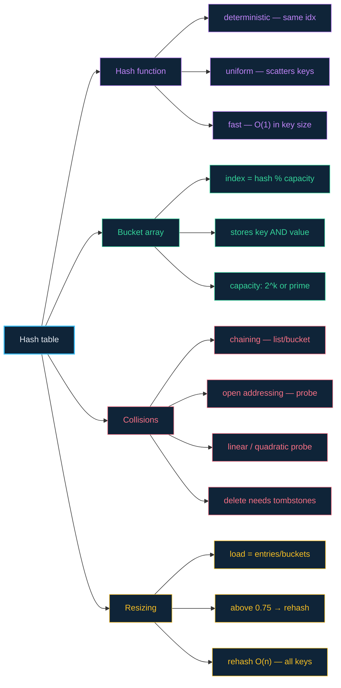

# 07 · Hash tables — compute the address instead of searching for it

> **The analogy.** A cloakroom. You hand over a coat and get ticket 47. When you come back, nobody searches the racks — the ticket *is* the location. The clever part is that the ticket number was **computed from the coat**, so you never had to be told where it went.

---

## 🎞️ Animations

**A key becomes an index, in constant time.**


**Two keys can land on the same index. That is expected, not broken.**


---

## 🧠 Mental model

| Cloakroom | Hash table |
|:--|:--|
| the coat | the **key** |
| the rack slot | the **bucket** |
| the rule that turns a coat into a ticket number | the **hash function** |
| the numbered rack | the underlying **array** |
| two coats given the same ticket | a **collision** |
| hanging both coats on one hook | **separate chaining** |
| putting the second coat on the next free hook | **open addressing** |
| the cloakroom getting too full to work well | the **load factor** rising |

The whole idea is a swap: instead of *searching* for where something is, you *compute* where it must be. Searching is `O(n)`; computing is `O(1)`.

---

## 📐 Blueprint


---

## 🗺️ Mindmap



---

## ⚙️ Operations

The table is a list of buckets; each bucket is a list of `(key, value)` pairs.

**The index — compute the address instead of searching for it.**

```text
index ← hash(key) mod capacity          O(1), and it is the whole idea
```

<!-- py:ops_hash:index_for -->
```python
def index_for(key: Any, capacity: int) -> int:
    """Compute the address instead of searching for it. O(1)."""
    return hash(key) % capacity           # change capacity and every key moves
```
<!-- /py -->

**Insert or update.**

```text
function put(T, key, value)
    index ← hash(key) mod T.capacity

    for each entry in T.buckets[index] do
        if entry.key = key then
            entry.value ← value                 update, do not duplicate
            return
        end
    end

    append (key, value) to T.buckets[index]
    T.count ← T.count + 1

    if T.count / T.capacity > 0.75 then
        resize(T)                               grow and rehash — O(n)
    end
```

<!-- py:ops_hash:put -->
```python
def put(buckets: list[list[tuple]], key: Any, value: Any) -> bool:
    """Insert or update. Returns True if this was a new key."""
    chain = buckets[index_for(key, len(buckets))]
    for i, (k, _) in enumerate(chain):
        if k == key:
            chain[i] = (key, value)       # update, never duplicate
            return False
    chain.append((key, value))            # collisions just extend the chain
    return True
```
<!-- /py -->

**Lookup.**

```text
function get(T, key)
    index ← hash(key) mod T.capacity            O(1)
    for each entry in T.buckets[index] do       walk this bucket's chain only
        if entry.key = key then                 compare the FULL key, not the hash
            return entry.value
        end
    end
    return notFound
```

<!-- py:ops_hash:get -->
```python
def get(buckets: list[list[tuple]], key: Any, default: Any = None) -> Any:
    """O(1) to find the bucket, then a walk of that chain only."""
    for k, v in buckets[index_for(key, len(buckets))]:
        if k == key:                      # compare the FULL key: a matching
            return v                      # bucket only means the hashes agreed
    return default
```
<!-- /py -->

> **Why compare the full key?** A matching index only means the hashes collided *modulo the capacity* — an enormous number of unrelated keys satisfy that. Skipping the key comparison returns other people's values.

**Delete.**

```text
function delete(T, key)
    index ← hash(key) mod T.capacity
    remove the entry with this key from T.buckets[index], if present
```

<!-- py:ops_hash:delete -->
```python
def delete(buckets: list[list[tuple]], key: Any) -> bool:
    chain = buckets[index_for(key, len(buckets))]
    for i, (k, _) in enumerate(chain):
        if k == key:
            chain.pop(i)
            return True
    return False
```
<!-- /py -->

**Resize — why every key must be recomputed.**

```text
function resize(T)
    old ← T.buckets
    T.capacity ← T.capacity × 2
    T.buckets ← new array of empty chains

    for each chain in old do
        for each entry in chain do
            put(T, entry.key, entry.value)      index = hash mod capacity, and
        end                                     capacity just changed — so every
    end                                         key moves. This is the O(n) cost.
```

<!-- py:ops_hash:resize -->
```python
def resize(buckets: list[list[tuple]]) -> list[list[tuple]]:
    """Double the table and rehash everything. O(n).

    The index is `hash(key) % capacity`, so changing the capacity gives
    essentially every key a new home. That is why you double rather than
    grow by one.
    """
    entries = [pair for chain in buckets for pair in chain]
    bigger: list[list[tuple]] = [[] for _ in range(len(buckets) * 2)]
    for k, v in entries:
        bigger[index_for(k, len(bigger))].append((k, v))
    return bigger
```
<!-- /py -->

**Load factor — the number that decides when to resize.**

```text
loadFactor ← T.count / T.capacity       above ~0.75, chains lengthen fast
```

<!-- py:ops_hash:load_factor -->
```python
def load_factor(buckets: list[list[tuple]]) -> float:
    """Above ~0.75 the chains lengthen and O(1) starts to decay."""
    return sum(len(c) for c in buckets) / len(buckets)
```
<!-- /py -->

> **Open addressing — the other collision policy.** Instead of a chain per bucket, probe for the next free slot: `index ← (index + 1) mod capacity`. Cache-friendly and pointer-free, but **deletion needs tombstones** — emptying a slot outright breaks the probe chain for keys that hopped over it.

Every Python function above is covered by [`examples/test_ops.py`](../examples/test_ops.py).

---

## ⏱️ Complexity

| Operation | Average | Worst | Why the worst case |
|:--|:--:|:--:|:--|
| lookup | **O(1)** | O(n) | every key collides into one bucket |
| insert | **O(1)** | O(n) | same, plus the occasional `O(n)` rehash |
| delete | **O(1)** | O(n) | same |
| iterate all entries | O(n + capacity) | O(n + capacity) | you must skip the empty buckets too |
| ordered traversal | **impossible** | — | a hash table has no order at all |

**Space:** `O(n + capacity)`. A hash table deliberately keeps spare capacity — that slack is what keeps collisions rare.

> **How real libraries avoid the worst case:** modern implementations use randomised hash seeds (so an attacker cannot craft colliding keys — a real denial-of-service vector) and convert a bucket's chain into a balanced tree once it grows past a threshold, capping the worst case at `O(log n)`.

---

## ⚖️ Trade-offs

| ✅ Reach for a hash table when | ❌ Avoid a hash table when |
|:--|:--|
| you look things up **by key** | you need keys in sorted order — use a [balanced BST](11-balanced-trees.md) |
| you need the fastest possible membership test | you need range queries ("all keys between 10 and 20") |
| insertion order does not matter | you need the minimum or maximum cheaply — use a [heap](09-heaps.md) |
| you are de-duplicating — see [sets](08-sets.md) | worst-case latency must be bounded (the rehash is a spike) |
| your keys are hashable and compare cheaply | memory is very tight — the spare capacity is real |

---

## 🃏 Flashcards

<details><summary>What three properties must a hash function have?</summary>

**Deterministic** (same key always gives the same index), **uniform** (spreads keys evenly, and scatters similar keys apart), and **fast** (constant in practice). Lose determinism and lookups fail; lose uniformity and you get long chains.
</details>

<details><summary>Is a collision a bug?</summary>

**No.** With more possible keys than buckets, collisions are mathematically unavoidable — the pigeonhole principle. A hash table is *designed* around handling them. A collision is only a problem when there are too many, which is what the load factor tracks.
</details>

<details><summary>Chaining vs open addressing?</summary>

**Chaining** keeps a list per bucket: simple, tolerates a high load factor, but costs a pointer per entry and scatters memory. **Open addressing** probes for the next free slot: cache-friendly and no pointers, but degrades sharply near full and makes deletion awkward (tombstones).
</details>

<details><summary>What is the load factor and why does 0.75 keep appearing?</summary>

`entries / buckets`. Below ~0.75 collisions stay rare and operations stay effectively `O(1)`; above it, chains lengthen fast and performance falls off a cliff. 0.75 is the conventional compromise between wasted memory and collision rate.
</details>

<details><summary>Why does resizing require rehashing every key?</summary>

Because the index is `hash mod capacity`. Change the capacity and the modulo produces a different index for essentially every key, so every entry must be relocated. That is why resizing is `O(n)` and why you double rather than grow by one.
</details>

<details><summary>Why can a hash table not support range queries?</summary>

A good hash function deliberately destroys the relationship between keys — 10 and 11 land in unrelated buckets. There is no way to walk "the next key up" without scanning the whole table. Ordering is the thing you traded away for `O(1)`.
</details>

---

## ❓ Quiz

**1.** Two keys hash to the same index. With chaining, what does a lookup for the second key cost?

<details><summary>Answer</summary>

`O(1)` to compute the index, then a walk of that bucket's chain comparing full keys — `O(chain length)`, so `O(2)` here. Short chains are why the average stays `O(1)`.
</details>

**2.** Your hash function returns a constant. What have you built?

<details><summary>Answer</summary>

A **linked list wearing a hash table costume.** Every key lands in one bucket, so every operation walks the whole chain: `O(n)`. This is exactly the worst case, and exactly what a hash-collision DoS attack engineers deliberately.
</details>

**3.** You need to print all entries in sorted key order. What should you have used?

<details><summary>Answer</summary>

A **balanced BST** (a sorted map). From a hash table your only option is to extract every key and sort them — `O(n log n)` every time you ask. If ordered output is a requirement, the hash table was the wrong choice.
</details>

**4.** Why must you compare the full key after finding the bucket, rather than trusting the hash?

<details><summary>Answer</summary>

Because the bucket index is `hash mod capacity`, so a match means only that two keys' hashes agreed *modulo the capacity* — an enormous number of unrelated keys satisfy that. Skipping the key comparison returns other people's values.
</details>

---

⬅️ [06 · Queues](06-queues.md) · [🏠 Index](../README.md) · [08 · Sets](08-sets.md) ➡️
