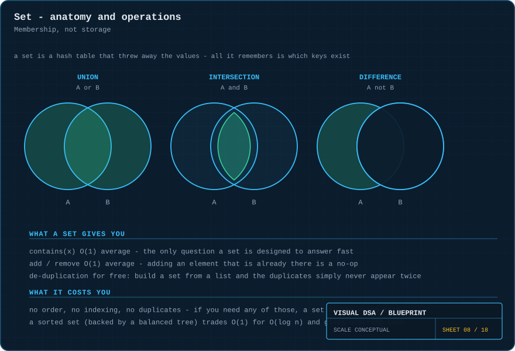
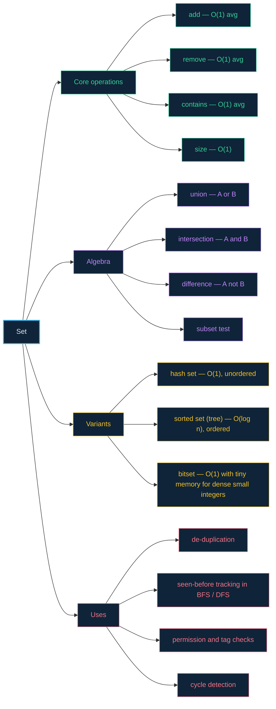

# 08 · Sets — one question, answered instantly

> **The analogy.** A guest list at the door. Your name is on it or it is not. Nobody cares what position you occupy on the list, and writing your name twice changes nothing at all. That indifference to order and to duplication is the entire definition of a set.

---

## 🎞️ Animation


Duplicates do not error, do not queue and do not overwrite — they are simply **absorbed**. Adding an element that is already present is a no-op.

---

## 🧠 Mental model

| Guest list | Set |
|:--|:--|
| "am I on the list?" | `contains(x)` — the one operation that matters |
| adding a name already there | a no-op, not an error |
| the order names were written | **irrelevant and not stored** |
| position 4 on the list | **not addressable** — sets have no indices |
| two lists merged | **union** |
| names on both lists | **intersection** |
| names on mine but not yours | **difference** |

A set is a [hash table](07-hash-tables.md) that discarded the values and kept only the keys. Every cost and every limitation follows directly from that.

---

## 📐 Blueprint



---

## 🗺️ Mindmap



---

## ⚙️ Operations

**The single most common real use — de-duplication.**

<!-- py:ops_sets:unique -->
```python
def unique(values: list[Any]) -> list[Any]:
    """De-duplicate in O(n), preserving first-seen order.

    The nested-loop alternative is O(n^2): at n = 10,000 that is 10^8
    comparisons against 10^4.
    """
    seen: set[Any] = set()
    out: list[Any] = []
    for v in values:
        if v not in seen:                 # O(1) average
            seen.add(v)
            out.append(v)
    return out
```
<!-- /py -->

**Set algebra — note which side you iterate.**

<!-- py:ops_sets:intersection -->
```python
def intersection(a: set[Any], b: set[Any]) -> set[Any]:
    """Iterate the SMALLER set and probe the larger one.

    Each probe is O(1), so the loop count is the entire cost: O(min(|a|,|b|))
    rather than O(max(|a|,|b|)). Getting this backwards on a 10-element set
    against a 10-million-element one is a millionfold waste.
    """
    small, large = (a, b) if len(a) <= len(b) else (b, a)
    return {x for x in small if x in large}
```
<!-- /py -->

> **Iterate the smaller, probe the larger.** Both are `O(1)` per probe, so the loop count is what decides the cost.

<!-- py:ops_sets:union -->
```python
def union(a: set[Any], b: set[Any]) -> set[Any]:
    """Everything in either. O(|a| + |b|)."""
    out = set(a)
    for x in b:
        out.add(x)                        # adding something already there is a no-op
    return out
```
<!-- /py -->

<!-- py:ops_sets:difference -->
```python
def difference(a: set[Any], b: set[Any]) -> set[Any]:
    """In a but not b. O(|a|)."""
    return {x for x in a if x not in b}
```
<!-- /py -->

**The second most common use — "have I been here before?"**

<!-- py:ops_sets:seen_before -->
```python
def seen_before(start: Any, neighbours_of) -> list[Any]:
    """The other everyday use: 'have I been here?' during a traversal.

    Without the set, a cyclic graph loops forever.
    """
    visited = {start}
    queue = [start]
    order = []
    while queue:
        node = queue.pop(0)
        order.append(node)
        for n in neighbours_of(node):
            if n not in visited:
                visited.add(n)
                queue.append(n)
    return order
```
<!-- /py -->

Without the `visited` set, a cyclic graph makes this loop forever. The set turns an infinite walk into an `O(V+E)` traversal.

Every function above is covered by [`examples/test_ops.py`](../examples/test_ops.py).

---

## ⏱️ Complexity

| Operation | Hash set | Sorted set (tree) | Bitset |
|:--|:--:|:--:|:--:|
| `add` | O(1) avg | O(log n) | O(1) |
| `contains` | O(1) avg | O(log n) | O(1) |
| `remove` | O(1) avg | O(log n) | O(1) |
| min / max | O(n) | **O(log n)** | O(u) |
| ordered iteration | **impossible** | **O(n)** | O(u) |
| union / intersection | O(n) | O(n) | **O(u/64)** — word-at-a-time |
| space | O(n) | O(n) | O(u) bits |

`u` is the size of the universe of possible values — a bitset over "integers 0…1,000,000" costs 125 KB regardless of how many are present.

---

## ⚖️ Trade-offs

| ✅ Reach for a set when | ❌ Avoid a set when |
|:--|:--|
| the only question is "is this present?" | you need to store a value against the key — use a **map** |
| you are removing duplicates | duplicates are meaningful (use a multiset / counter) |
| you need "have I seen this?" during a traversal | order matters — use a list, or a sorted set |
| you are intersecting or unioning collections | you need element number 7 — sets have no indices |

**Picking the variant:** unordered and fastest → **hash set**. Need sorted iteration, min/max or ranges → **sorted set**. Dense small integers → **bitset**, which is dramatically faster and smaller than both.

---

## 🃏 Flashcards

<details><summary>What is the relationship between a set and a hash table?</summary>

A hash set *is* a hash table storing only keys, with the value slot removed. Every performance characteristic — `O(1)` average, `O(n)` worst case, no ordering, load factor and rehashing — carries over unchanged.
</details>

<details><summary>Adding an element that is already present — what happens?</summary>

**Nothing.** It is a no-op, silently. This is the property that makes de-duplication free: you do not have to check first, because adding twice is identical to adding once.
</details>

<details><summary>Why does de-duplicating with a set beat nested loops?</summary>

Nested loops compare every element against every earlier one: `O(n²)`. A set answers "have I seen this?" in `O(1)`, so one pass is `O(n)`. At `n = 10,000` that is 100,000,000 operations against 10,000.
</details>

<details><summary>When intersecting two sets, which one should you loop over?</summary>

The **smaller** one, probing the larger. Each probe is `O(1)`, so the iteration count is the entire cost: `O(min(|A|, |B|))` instead of `O(max(|A|, |B|))`.
</details>

<details><summary>What does a sorted set give you that a hash set cannot?</summary>

Ordered iteration, `O(log n)` min and max, and range queries ("every key between 10 and 20"). The price is `O(log n)` instead of `O(1)` on every operation. It is backed by a balanced tree, not a hash table.
</details>

<details><summary>When is a bitset the right answer?</summary>

When your elements are integers from a small, dense, known range. Membership becomes a single bit test, and union/intersection become bitwise OR/AND across whole 64-bit words — often 64 elements per instruction.
</details>

---

## ❓ Quiz

**1.** You add the values 5, 3, 5, 9, 3 to a set. What is its size?

<details><summary>Answer</summary>

**3** — {5, 3, 9}. The repeats were absorbed. And there is no defined order in which they will come back out.
</details>

**2.** Why does BFS need a `visited` set?

<details><summary>Answer</summary>

Because a graph can contain cycles. Without it, the algorithm re-enqueues nodes it has already processed and never terminates. The set turns an infinite walk into an `O(V+E)` traversal.
</details>

**3.** You need to know how many times each word appears in a document. Is a set the right tool?

<details><summary>Answer</summary>

**No** — a set records only *whether* something is present, never how many times. You want a **map** from word to count (a counter / multiset). Reaching for a set here loses exactly the information you asked for.
</details>

**4.** Set A has 10 elements, set B has 10,000,000. You loop over B probing A. What did that cost you?

<details><summary>Answer</summary>

`O(10,000,000)` instead of `O(10)` — a millionfold waste. The result is identical; only the running time differs. Always iterate the smaller collection.
</details>

---

⬅️ [07 · Hash tables](07-hash-tables.md) · [🏠 Index](../README.md) · [09 · Heaps](09-heaps.md) ➡️
