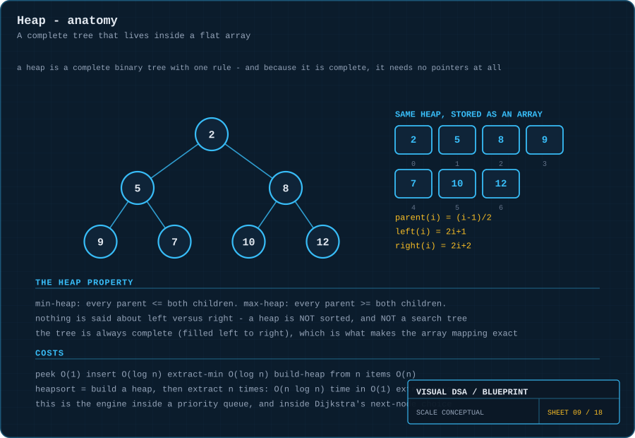
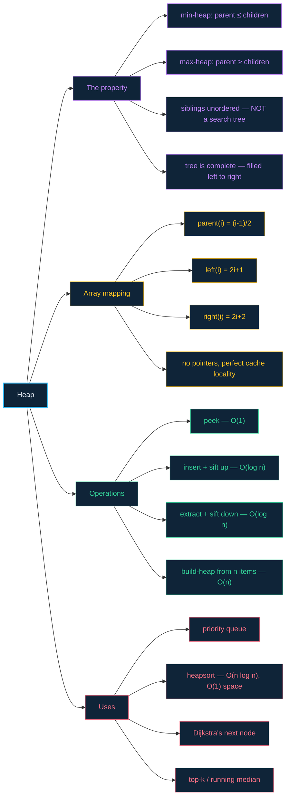

# 09 · Heaps — a complete tree that lives inside a flat array

> **The analogy.** A company where the only rule is *"every manager earns less than everyone who reports to them"*. Nobody enforces an ordering between two peers, and nobody knows the full ranking. But you always know, instantly and with certainty, who earns the least: the person at the top.

---

## 🎞️ Animations

**Insert: a new arrival keeps swapping upward until nobody above it is smaller.**


**Extract-min: the root leaves, the last leaf takes the chair, and sinks to its real level.**


---

## 🧠 Mental model

| Company hierarchy | Min-heap |
|:--|:--|
| every manager earns less than their reports | every parent ≤ both children |
| two peers — no rule at all | siblings are unordered; a heap is **not sorted** |
| the CEO earns least | the minimum is always at the root |
| a new hire climbs to their level | **sift up** after insert |
| the CEO leaves, someone is promoted temporarily, then demoted to their real level | **sift down** after extract |
| everyone has a seat, filled left to right | the tree is **complete** |

Two facts do all the work:

1. **The heap property is local** — it only constrains parent-to-child — yet it globally guarantees the root is the extreme value.
2. **The tree is complete**, so it maps perfectly onto an array with no gaps and needs **no pointers at all**.

---

## 📐 Blueprint



---

## 🗺️ Mindmap



---

## ⚙️ Operations

**The index arithmetic — this is why a heap needs no pointers.**

```text
parent(i) = (i - 1) / 2          integer division
left(i)   = 2i + 1
right(i)  = 2i + 2
```

Because the tree is complete, level-order position *is* array index. There are no gaps to account for.

**Insert — place at the end, then climb.**

```text
function insert(H, value)
    H[H.size] ← value                       the next free leaf keeps the tree complete
    H.size ← H.size + 1
    siftUp(H, H.size - 1)

function siftUp(H, i)
    while i > 0 and H[i] < H[parent(i)] do
        swap(H[i], H[parent(i)])
        i ← parent(i)                       at most log n swaps — the height
    end
```

**Extract-min — take the root, patch the hole, then sink.**

```text
function extractMin(H)
    if H.size = 0 then error "empty" end

    minimum ← H[0]                          the answer
    H[0] ← H[H.size - 1]                    move the LAST LEAF to the root:
    H.size ← H.size - 1                     the only move that keeps the tree complete
    siftDown(H, 0)
    return minimum

function siftDown(H, i)
    loop
        smallest ← i
        if left(i)  < H.size and H[left(i)]  < H[smallest] then smallest ← left(i)  end
        if right(i) < H.size and H[right(i)] < H[smallest] then smallest ← right(i) end
        if smallest = i then return end     it is already in the right place

        swap(H[i], H[smallest])
        i ← smallest                        follow it down
    end
```

> **Why swap with the *smaller* child?** Swapping with the larger one would put the larger child above the smaller one — violating the heap property on the other side. Only the smaller child is guaranteed to be a legal new parent for both.

**Build-heap — `O(n)`, and the reason is worth knowing.**

```text
function buildHeap(A)
    for i ← (A.length / 2) - 1 down to 0 do     every node above the leaf row
        siftDown(A, i)                          leaves are already valid heaps
    end
```

> **Why is this `O(n)` and not `O(n log n)`?** Because `siftDown` costs the *height below* the node, and almost all nodes are near the bottom. Half the nodes are leaves and cost 0, a quarter cost 1, an eighth cost 2… The sum converges to `2n`. Only the single root pays the full `log n`.

**Heapsort — a heap's other job.**

```text
function heapsort(A)
    buildHeap(A)                                O(n), max-heap
    for i ← A.length - 1 down to 1 do
        swap(A[0], A[i])                        largest goes to its final slot
        A.heapSize ← A.heapSize - 1
        siftDown(A, 0)                          O(log n) each
    end                                         O(n log n) total, O(1) extra space
```

---

## ⏱️ Complexity

| Operation | Time | Why |
|:--|:--:|:--|
| `peek` (find min/max) | **O(1)** | it is `H[0]`, by the heap property |
| `insert` | O(log n) | at most one swap per level of height |
| `extractMin` | O(log n) | same, sinking instead of climbing |
| `buildHeap` from n items | **O(n)** | most nodes sift down almost no distance |
| search for an arbitrary value | **O(n)** | the heap gives no guidance about siblings |
| delete an arbitrary value | O(n) | finding it dominates; the fix afterwards is `O(log n)` |
| heapsort | O(n log n) | `O(n)` build + `n` extractions |

**Space:** `O(n)` — and the array representation means **zero** pointer overhead, plus excellent cache behaviour.

---

## ⚖️ Trade-offs

| ✅ Reach for a heap when | ❌ Avoid a heap when |
|:--|:--|
| you repeatedly need the smallest or largest item | you need to search for arbitrary values — use a hash table or BST |
| you are implementing a [priority queue](06-queues.md) | you need fully sorted output cheaply — a heap gives you it one `O(log n)` extraction at a time |
| you need top-k from a stream (keep a size-k heap) | you need ordered traversal or range queries |
| you want `O(n log n)` sorting in `O(1)` extra space | you need stability in sorting — heapsort is not stable |
| you are running [Dijkstra](18-dijkstra.md) | |

---

## 🃏 Flashcards

<details><summary>Is a heap sorted?</summary>

**No.** The only constraint is between parent and child. Siblings are unordered, and the array `[2, 5, 8, 9, 7]` is a perfectly valid min-heap despite not being sorted. A heap gives you the extreme value, not the ordering.
</details>

<details><summary>Why does a heap need no pointers?</summary>

Because it is a **complete** tree — every level full except possibly the last, which fills left to right. That leaves no gaps, so level-order position maps exactly onto array index, and `parent`/`left`/`right` become arithmetic.
</details>

<details><summary>Why is the LAST leaf moved to the root on extract?</summary>

To preserve completeness. Removing the last leaf is the only removal that cannot leave a hole in the middle of the tree. Its value is then almost certainly wrong for the root, which is what `siftDown` repairs.
</details>

<details><summary>Why swap with the smaller child in a min-heap, not just any smaller child?</summary>

The promoted child becomes the parent of the other one. Only the smaller of the two is guaranteed to be ≤ its new sibling, so choosing the larger would immediately violate the heap property on the other branch.
</details>

<details><summary>Why is build-heap O(n) when it calls an O(log n) routine n/2 times?</summary>

Because `siftDown`'s real cost is the height *below* the node, and the tree is bottom-heavy: half the nodes are leaves (cost 0), a quarter have height 1, an eighth height 2. The series `n/4·1 + n/8·2 + n/16·3 + …` converges to `O(n)`.
</details>

<details><summary>How do you find the top 5 largest items in a 10-million-item stream?</summary>

Keep a **min-heap of size 5**. For each item, if the heap has fewer than 5 push it; otherwise if the item beats the root, pop and push. `O(n log 5)` time and `O(5)` memory — you never have to hold the stream.
</details>

---

## ❓ Quiz

**1.** Is `[10, 15, 20, 17, 25]` a valid min-heap?

<details><summary>Answer</summary>

**Yes.** Check each parent: 10 ≤ 15 and 10 ≤ 20; 15 ≤ 17 and 15 ≤ 25. The heap property holds everywhere. That the array is not sorted is irrelevant — heaps never are.
</details>

**2.** You want the 3rd smallest of a million numbers. Sort them, or use a heap?

<details><summary>Answer</summary>

**Heap.** `buildHeap` is `O(n)` and three extractions are `O(3 log n)` — essentially `O(n)`. Sorting is `O(n log n)` and computes 999,997 orderings you did not ask for.
</details>

**3.** Where in a min-heap is the **largest** element?

<details><summary>Answer</summary>

**Somewhere in the leaf row**, but the heap does not say where. You must scan all `n/2` leaves — `O(n)`. A min-heap is fast at exactly one end. If you need both, use two heaps or a balanced BST.
</details>

**4.** You call `extractMin` on a heap of 1,000,000 items. How many comparisons roughly?

<details><summary>Answer</summary>

About **20 levels × 2 comparisons = ~40**. The height of a complete binary tree with a million nodes is `log₂(1,000,000) ≈ 20`, and each `siftDown` level compares against both children.
</details>

---

⬅️ [08 · Sets](08-sets.md) · [🏠 Index](../README.md) · [10 · Binary search trees](10-binary-search-trees.md) ➡️
