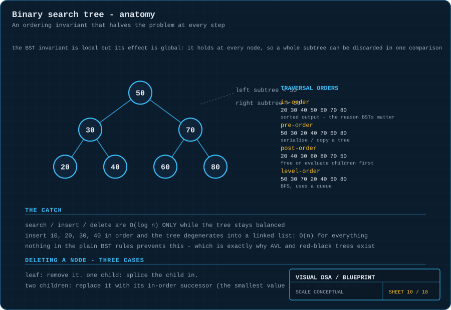
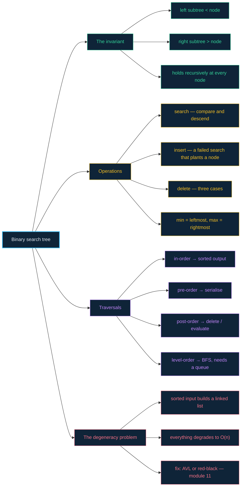

# 10 · Binary search trees — an invariant that halves the problem

> **The analogy.** Twenty questions. "Is it bigger than 50?" — and half of everything is gone, permanently, on one answer. A BST is that game made structural: the ordering rule is written into the shape of the tree, so every comparison discards an entire subtree without ever looking inside it.

---

## 🎞️ Animations

**Search: one comparison, half the tree gone.**


**Insert: walk until you fall off the tree, then plant yourself there.**


---

## 🧠 Mental model

| Twenty questions | Binary search tree |
|:--|:--|
| "bigger or smaller than X?" | compare against the current node |
| the eliminated half | the discarded subtree |
| the question you are on | the current node |
| running out of questions | reaching `null` — not found |
| a well-balanced set of questions | a balanced tree, `O(log n)` |
| every question splitting off one item | a **degenerate** tree, `O(n)` |

**The invariant, stated precisely:** for every node, *every* value in its left subtree is smaller, and *every* value in its right subtree is larger. Not just its immediate children — the whole subtree. That is what makes discarding a branch safe.

---

## 📐 Blueprint



---

## 🗺️ Mindmap



---

## ⚙️ Operations

**Search.**

```text
function search(node, target)
    while node ≠ null do
        if target = node.value then return node
        else if target < node.value then node ← node.left       discard the right subtree
        else                            node ← node.right       discard the left subtree
        end
    end
    return notFound
```

Every iteration throws away a subtree **without inspecting a single node in it**. That is where the `log n` comes from.

**Insert — the same walk, ending in a plant.**

```text
function insert(node, value)
    if node = null then return new Node(value) end       you fell off: this is the slot

    if value < node.value then
        node.left  ← insert(node.left, value)
    else if value > node.value then
        node.right ← insert(node.right, value)
    end                                                  equal: ignore, or count duplicates

    return node
```

A new value **never displaces an existing node**. It walks down until it runs off the tree, and that empty position is its home.

**Delete — three cases, and only the third is interesting.**

```text
function delete(node, value)
    if node = null then return null end

    if value < node.value then
        node.left ← delete(node.left, value)
    else if value > node.value then
        node.right ← delete(node.right, value)
    else
        CASE 1 — no children:
            return null                                  just drop it

        CASE 2 — one child:
            return that child                            splice it in

        CASE 3 — two children:
            successor ← minimum(node.right)              smallest value larger than this one
            node.value ← successor.value                 overwrite in place
            node.right ← delete(node.right, successor.value)
    end
    return node
```

> **Why the in-order successor?** It is the only value that can sit in that position without breaking the invariant: it is larger than everything in the left subtree (it is in the right one) and smaller than everything else in the right subtree (it is the minimum there). The predecessor — the maximum of the left subtree — works symmetrically.

**Traversals — one function, three different placements of one line.**

```text
function inOrder(node)                  LEFT, node, RIGHT  →  sorted output
    if node = null then return end
    inOrder(node.left)
    visit(node)
    inOrder(node.right)

function preOrder(node)                 node, LEFT, RIGHT  →  copy / serialise
    if node = null then return end
    visit(node)
    preOrder(node.left)
    preOrder(node.right)

function postOrder(node)                LEFT, RIGHT, node  →  free / evaluate
    if node = null then return end
    postOrder(node.left)
    postOrder(node.right)
    visit(node)
```


---

## ⏱️ Complexity

| Operation | Balanced | Degenerate | Why |
|:--|:--:|:--:|:--|
| search | **O(log n)** | **O(n)** | height of the tree, exactly |
| insert | O(log n) | O(n) | a search plus one pointer write |
| delete | O(log n) | O(n) | a search plus at most one successor hunt |
| minimum / maximum | O(log n) | O(n) | walk fully left / fully right |
| in-order traversal | O(n) | O(n) | every node once, regardless of shape |

**Space:** `O(n)` for the nodes, plus `O(height)` for the recursion stack — `O(log n)` balanced, `O(n)` degenerate.

> **Every single row says "height".** A BST has no complexity of its own; it inherits the height of whatever shape your insertion order happened to produce. That is the problem [module 11](11-balanced-trees.md) exists to solve.

---

## ⚖️ Trade-offs

| ✅ Reach for a BST when | ❌ Avoid a BST when |
|:--|:--|
| you need sorted order *and* fast lookup | you only need exact-match lookup — a [hash table](07-hash-tables.md) is `O(1)` |
| you need range queries ("everything between 10 and 20") | your insertion order is sorted and you are using a plain BST |
| you need min, max, predecessor or successor | you need worst-case guarantees — use a **balanced** tree |
| you want `O(n)` sorted output on demand | memory is tight — two pointers per node |

---

## 🃏 Flashcards

<details><summary>State the BST invariant precisely.</summary>

For every node: **every** value in the left subtree is smaller, and **every** value in the right subtree is larger. It is a claim about entire subtrees, not just immediate children — which is exactly what licenses discarding a branch unexamined.
</details>

<details><summary>What does an in-order traversal of any BST produce?</summary>

The values in **sorted ascending order**, always. This is also the cleanest way to verify a BST: traverse in-order and check the output is non-decreasing.
</details>

<details><summary>How does a BST degenerate, and what does it become?</summary>

Insert values in sorted order (10, 20, 30, 40…). Each one is larger than everything before it, so it becomes the right child of the previous — a **linked list** with extra pointers. Height goes from `log n` to `n`, and every operation degrades with it.
</details>

<details><summary>Deleting a node with two children — what replaces it and why?</summary>

Its **in-order successor** (the minimum of the right subtree), or symmetrically its predecessor. It is the only value that is simultaneously larger than the entire left subtree and smaller than the rest of the right subtree — so the invariant survives.
</details>

<details><summary>Where are the minimum and maximum?</summary>

The minimum is the **leftmost** node (walk `left` until `null`), the maximum is the **rightmost**. Both cost `O(height)`.
</details>

<details><summary>BST or hash table?</summary>

**Hash table** if you only ever ask "is this exact key present?" — `O(1)` beats `O(log n)`. **BST** the moment you need order: sorted iteration, min/max, ranges, or nearest-neighbour queries. Those are impossible in a hash table at any price.
</details>

---

## ❓ Quiz

**1.** You insert 10, 20, 30, 40, 50 into an empty BST in that order. What is the height?

<details><summary>Answer</summary>

**5 — a straight line to the right.** Each value is larger than all before it, so it becomes the right child of the previous. This is the degenerate case, and search is now `O(n)`.
</details>

**2.** Searching for 40 in a balanced BST of 1,000,000 nodes costs roughly how many comparisons?

<details><summary>Answer</summary>

About **20**, because `log₂(1,000,000) ≈ 20`. Each comparison eliminates half a million candidates without looking at any of them.
</details>

**3.** Someone gives you an in-order traversal that reads 5, 3, 8. What do you know?

<details><summary>Answer</summary>

That it is **not a valid BST**. In-order traversal of a BST is always sorted ascending; 5 before 3 proves the invariant is broken somewhere.
</details>

**4.** Why is a plain BST unsafe for user-supplied input?

<details><summary>Answer</summary>

Because the caller controls the insertion order, and sorted input degenerates the tree into a linked list — turning your advertised `O(log n)` into `O(n)`. Either randomise insertion or use a self-balancing tree; on an adversarial input this is a genuine denial-of-service vector.
</details>

---

⬅️ [09 · Heaps](09-heaps.md) · [🏠 Index](../README.md) · [11 · Balanced trees](11-balanced-trees.md) ➡️
