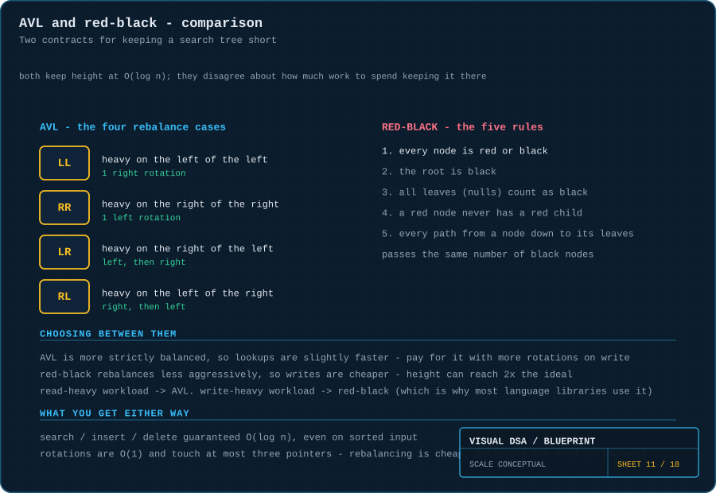
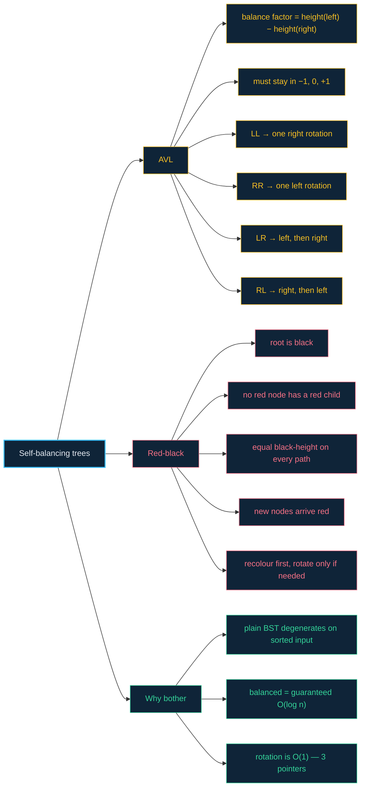

# 11 · Balanced trees — the tree that straightens its own spine

> **The analogy.** A plain [BST](10-binary-search-trees.md) is a bookshelf that whoever fills it can accidentally turn into a single vertical tower. A balanced tree is the same shelf with a librarian standing beside it, who after every single insertion rearranges just enough to make sure the tower never forms. AVL and red-black are two librarians with different levels of fussiness.

---

## 🎞️ Animations

**AVL: the balance factor hits ±2, and one rotation fixes it.**


**Red-black: recolour first, rotate only if recolouring is not enough.**


---

## 🧠 Mental model

| Idea | AVL | Red-black |
|:--|:--|:--|
| how strict is the librarian? | very — heights may differ by at most 1 | relaxed — one path may be twice another |
| resulting height | ~`1.44 log n` | ~`2 log n` |
| work per insertion | more rotations | fewer rotations, more recolourings |
| best for | **read-heavy** workloads | **write-heavy** workloads |
| found in | databases, in-memory indexes | most standard library ordered maps |

Both give you the **same guarantee**: `O(log n)` for search, insert and delete, *no matter what order the data arrives in*. They differ only in how much they pay to keep it.

---

## 📐 Blueprint



---

## 🗺️ Mindmap



---

## ⚙️ Operations

**Rotation — the primitive both trees are built from.**

```text
function rotateRight(y)
    x ← y.left
    T ← x.right                     the subtree that must change parents

    x.right ← y                     x becomes the new root of this subtree
    y.left  ← T                     T is larger than x, smaller than y — still legal

    updateHeight(y)                 order matters: y is now BELOW x
    updateHeight(x)
    return x                        the caller must adopt the new subtree root
```

Three pointer writes, `O(1)`, and the BST invariant is preserved: `T` was between `x` and `y` before the rotation, and it still is after.

**AVL — insert, then rebalance on the way back up.**

```text
function insert(node, value)
    node ← ordinary BST insert
    updateHeight(node)
    balance ← height(node.left) − height(node.right)

    LL: balance > 1  and value < node.left.value
        return rotateRight(node)

    RR: balance < -1 and value > node.right.value
        return rotateLeft(node)

    LR: balance > 1  and value > node.left.value
        node.left ← rotateLeft(node.left)           straighten the zig-zag first
        return rotateRight(node)

    RL: balance < -1 and value < node.right.value
        node.right ← rotateRight(node.right)
        return rotateLeft(node)

    return node                                     already balanced
```

> **Why do LR and RL need two rotations?** A single rotation only straightens a *straight* lean. A zig-zag has to be converted into a straight lean first, and then rotated — hence two.

**Red-black — the five rules, and the repair loop.**

```text
1. every node is red or black
2. the root is black
3. all null leaves count as black
4. a red node never has a red child          ← violated by insertion
5. every path from a node to its leaves passes the same number of black nodes
```

```text
function insertFix(node)
    while node.parent is RED do
        uncle ← the sibling of node.parent

        CASE A — uncle is RED:
            recolour parent and uncle BLACK, grandparent RED
            node ← grandparent                  push the problem up, no rotation
            continue

        CASE B — uncle is BLACK:
            rotate around the grandparent, then recolour
            done                                at most 2 rotations, ever
    end
    root.colour ← BLACK                         rule 2, restored unconditionally
```

> **Why do new nodes arrive red?** Because inserting a black node would immediately break rule 5 on every path through it. A red node breaks only rule 4, and only if its parent is also red — a much cheaper, more local problem to fix.

---

## ⏱️ Complexity

| Operation | AVL | Red-black | Plain BST (worst) |
|:--|:--:|:--:|:--:|
| search | O(log n) | O(log n) | **O(n)** |
| insert | O(log n) | O(log n) | O(n) |
| delete | O(log n) | O(log n) | O(n) |
| rotations per insert | up to 2 | up to **2** | — |
| rotations per delete | up to **O(log n)** | up to **3** | — |
| height bound | ~1.44 log n | ~2 log n | n |

**Space:** `O(n)`, plus one small field per node — AVL stores a height (or a 2-bit balance factor); red-black stores a single colour bit.

> **The headline difference is in deletion.** AVL may rotate at every level on the way back up; red-black is capped at three rotations no matter how large the tree. That single fact is why standard libraries overwhelmingly ship red-black trees.

---

## ⚖️ Trade-offs

| ✅ Use **AVL** when | ✅ Use **red-black** when |
|:--|:--|
| reads vastly outnumber writes | writes are frequent |
| you want the shortest possible tree | you want predictable, bounded rebalancing work |
| lookup latency is the metric you are optimising | it is the default in your language's library — it usually is |

| ❌ Use neither when |
|:--|
| you never need ordering — a [hash table](07-hash-tables.md) is `O(1)`, not `O(log n)` |
| the dataset is small — the rebalancing bookkeeping is not worth it |
| the data is static — build a plain sorted array and binary search it |

---

## 🃏 Flashcards

<details><summary>What problem do balanced trees exist to solve?</summary>

BST degeneracy. A plain BST fed sorted input becomes a linked list, and every advertised `O(log n)` becomes `O(n)`. Balancing makes `O(log n)` a **guarantee** rather than a hope about the input order.
</details>

<details><summary>What is a balance factor?</summary>

`height(left) − height(right)` at a node. AVL requires it to stay in {−1, 0, +1}; the moment an insertion or deletion pushes it to ±2, a rotation restores it.
</details>

<details><summary>What does a rotation actually cost, and does it break the ordering?</summary>

`O(1)` — three pointer writes and two height updates. It **cannot** break the BST invariant: the subtree that changes parents was already between the two rotated nodes in value, and remains so.
</details>

<details><summary>Why do LR and RL cases need two rotations?</summary>

A single rotation fixes a straight lean (left-left or right-right). A zig-zag must first be rotated into a straight lean at the child, then rotated at the parent.
</details>

<details><summary>Why are newly inserted red-black nodes red?</summary>

A new black node would add one to the black-height of every path through it, breaking rule 5 globally. A red node can only break rule 4 (red parent with a red child) — a local violation that is repaired by recolouring, often without any rotation at all.
</details>

<details><summary>Which one do standard libraries use, and why?</summary>

**Red-black**, almost universally (C++ `std::map`, Java `TreeMap`, most others). Its deletion rebalancing is capped at 3 rotations versus AVL's `O(log n)`, which makes write-heavy performance far more predictable. AVL's slightly shorter tree rarely pays for that.
</details>

---

## ❓ Quiz

**1.** You insert 10, 20, 30 into an AVL tree. What happens on the third insert?

<details><summary>Answer</summary>

The root (10) reaches balance factor −2 with a right-right lean, triggering **one left rotation**. 20 becomes the root with 10 and 30 as children — height 2 instead of 3, and it stays that way no matter how much sorted data follows.
</details>

**2.** A red-black tree has a red node whose child is also red. What is happening?

<details><summary>Answer</summary>

Rule 4 is violated — this is the state immediately after an insertion, before the fix-up runs. The repair recolours the parent and uncle black and the grandparent red, pushing the violation upward; if the uncle is black, it rotates instead.
</details>

**3.** Both trees are `O(log n)`. Why choose one over the other?

<details><summary>Answer</summary>

Constant factors and *which* operation you do most. AVL keeps a shorter tree (faster lookups) but rebalances harder on writes. Red-black bounds deletion rebalancing at 3 rotations. Read-heavy → AVL; write-heavy → red-black.
</details>

**4.** Your tree is built once from static data and then only read. Which balancing scheme?

<details><summary>Answer</summary>

**Neither.** Sort the data and build a perfectly balanced tree directly in `O(n)` from the sorted array — or skip the tree entirely and binary search the array, which is smaller, faster and cache-friendly. Self-balancing machinery only pays for itself when the data changes.
</details>

---

⬅️ [10 · Binary search trees](10-binary-search-trees.md) · [🏠 Index](../README.md) · [12 · Tries](12-tries.md) ➡️
