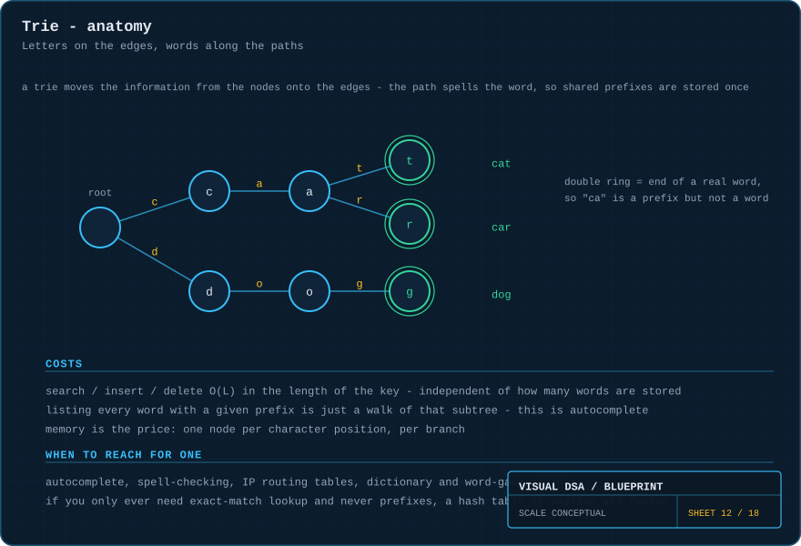
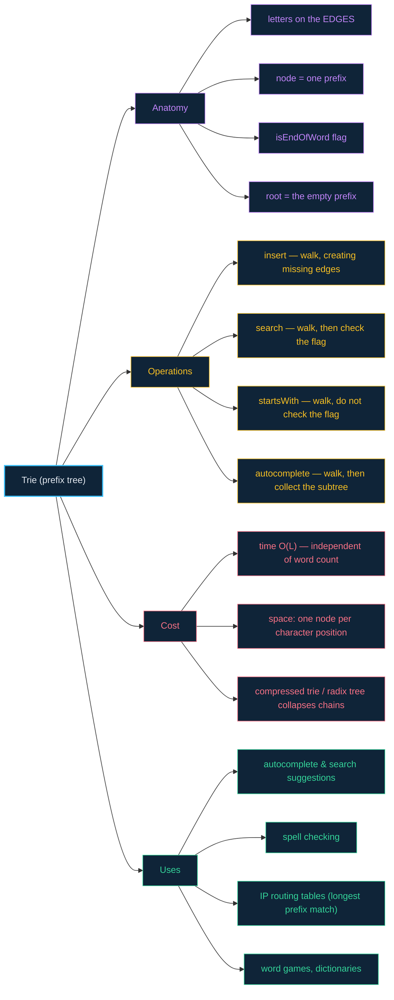

# 12 · Tries — the letters live on the edges

> **The analogy.** A filing cabinet where the drawers are labelled by letter. To find "cat" you open drawer C, then folder A, then file T. Every word starting with "ca" is inside that one folder — which is why the moment you have typed two letters, the machine already knows the ten things you might mean.

---

## 🎞️ Animation


Note where the letters are: **on the edges**, not in the nodes. A node is just "the place you have arrived after spelling this prefix".

---

## 🧠 Mental model

| Filing cabinet | Trie |
|:--|:--|
| a drawer labelled "C" | an **edge** labelled `c` |
| the place you are after opening C, then A | a **node** — meaning the prefix "ca" |
| the label sticker saying "this is a complete file" | `isEndOfWord` — the double ring in the diagrams |
| "cat" and "car" share drawer C and folder A | shared prefixes are stored **exactly once** |
| everything filed under "ca" | the entire subtree below that node |
| how long it takes to find a file | `O(L)` in the length of the word — **not** in how many words exist |

---

## 📐 Blueprint



---

## 🗺️ Mindmap



---

## ⚙️ Operations

**The node** stores no letter of its own — its identity comes entirely from the path taken to reach it.

```text
Node:
    children      map from character → Node
    isEndOfWord   boolean
```

<!-- py:nodes:TrieNode -->
```python
class TrieNode:
    """A trie node stores no letter of its own - the path to it is the prefix."""
    __slots__ = ("children", "is_end")

    def __init__(self) -> None:
        self.children: dict[str, "TrieNode"] = {}
        self.is_end = False
```
<!-- /py -->

**Insert.**

```text
function insert(root, word)
    node ← root
    for each ch in word do
        if node.children has no ch then
            node.children[ch] ← new Node()      only create what does not exist
        end
        node ← node.children[ch]
    end
    node.isEndOfWord ← true                     the flag is the whole point
```

<!-- py:ops_trie:insert -->
```python
def insert(root: TrieNode, word: str) -> None:
    """Creates only the nodes that do not exist yet.

    Inserting "car" when "cat" is already stored adds exactly one node.
    """
    node = root
    for ch in word:
        if ch not in node.children:
            node.children[ch] = TrieNode()
        node = node.children[ch]
    node.is_end = True                    # the flag is what makes it a word
```
<!-- /py -->

Inserting "car" after "cat" creates exactly **one** new node — the `r`. The `c` and `a` were already there and are simply reused.

**The walk both lookups share.**

```text
function walk(node, s)
    for each ch in s do
        if node.children has no ch then return null end
        node ← node.children[ch]
    end
    return node
```

<!-- py:ops_trie:walk -->
```python
def walk(root: TrieNode, s: str) -> Optional[TrieNode]:
    """Follow one edge per character. O(L), whatever the word count."""
    node = root
    for ch in s:
        if ch not in node.children:
            return None
        node = node.children[ch]
    return node
```
<!-- /py -->

**Search vs startsWith — the same walk, one different final line.**

```text
function search(root, word)
    node ← walk(root, word)
    return node ≠ null and node.isEndOfWord      "ca" walks fine but is not a word

function startsWith(root, prefix)
    node ← walk(root, prefix)
    return node ≠ null                           reaching the node is enough
```

<!-- py:ops_trie:search -->
```python
def search(root: TrieNode, word: str) -> bool:
    """Reaching the node is not enough - it must be marked as a word end."""
    node = walk(root, word)
    return node is not None and node.is_end
```
<!-- /py -->

<!-- py:ops_trie:starts_with -->
```python
def starts_with(root: TrieNode, prefix: str) -> bool:
    """The same walk, one different final line. This is the whole feature -
    a hash table cannot answer it without scanning every key."""
    return walk(root, prefix) is not None
```
<!-- /py -->

> **This one-line difference is the whole feature.** A hash table can answer `search`. Only a trie can answer `starts_with` without scanning everything.

**Autocomplete — walk to the prefix, then harvest the subtree.**

```text
function autocomplete(root, prefix)
    node ← walk(root, prefix)
    if node = null then return empty list end

    results ← empty list
    collect(node, prefix, results)
    return results

function collect(node, sofar, results)
    if node.isEndOfWord then append sofar to results end
    for each (ch, child) in node.children do
        collect(child, sofar + ch, results)      a DFS over the subtree
    end
```

<!-- py:ops_trie:autocomplete -->
```python
def autocomplete(root: TrieNode, prefix: str) -> list[str]:
    """O(L) to reach the prefix, then a walk of only that subtree.

    Every word in that subtree starts with the prefix by construction, so no
    non-matching word is ever visited.
    """
    node = walk(root, prefix)
    if node is None:
        return []
    out: list[str] = []

    def collect(n: TrieNode, so_far: str) -> None:
        if n.is_end:
            out.append(so_far)
        for ch, child in sorted(n.children.items()):
            collect(child, so_far + ch)

    collect(node, prefix)
    return out
```
<!-- /py -->

**Delete — the subtle one.**

```text
function delete(root, word)
    node ← walk(root, word)
    if node = null or not node.isEndOfWord then return false end
    node.isEndOfWord ← false                     unmark, do not unlink

    walking back up, prune a node only if:
        it has no children, AND
        it is not the end of some other word     ← "car" must survive deleting "cart"
```

<!-- py:ops_trie:delete -->
```python
def delete(root: TrieNode, word: str) -> bool:
    """Unset the flag, then drop any node nothing else needs.

    Returns True if the word was present. Deleting "cart" must not remove the
    c-a-r chain, because "car" still needs it - so a node is only dropped when
    it has no children AND is not itself the end of a word.
    """
    node = walk(root, word)
    if node is None or not node.is_end:
        return False                      # never stored: nothing to do
    node.is_end = False                   # the word is gone from the trie

    path = [root]                         # every node on the way down
    for ch in word:
        path.append(path[-1].children[ch])

    for depth in range(len(word), 0, -1):
        child = path[depth]
        if child.children or child.is_end:
            break                         # something still needs this node
        del path[depth - 1].children[word[depth - 1]]
    return True
```
<!-- /py -->

Every Python function above is covered by [`examples/test_ops.py`](../examples/test_ops.py).

---

## ⏱️ Complexity

`L` = length of the key. `n` = number of stored words. `A` = alphabet size.

| Operation | Time | Note |
|:--|:--:|:--|
| insert | **O(L)** | independent of how many words are stored |
| search | **O(L)** | same |
| startsWith | **O(L)** | impossible to do this fast in a hash table |
| autocomplete | O(L + k) | `k` = total size of the matching subtree |
| delete | O(L) | plus pruning on the way back up |

**Space:** `O(n × L × A)` in the worst case for an array-of-children implementation — the reason tries are memory-hungry. A hash map per node, or a **compressed trie** (radix tree) that collapses single-child chains into one edge, cuts this dramatically.

---

## ⚖️ Trade-offs

| ✅ Reach for a trie when | ❌ Avoid a trie when |
|:--|:--|
| you need **prefix** queries — autocomplete, suggestions | you only ever need exact match — a [hash table](07-hash-tables.md) is faster and far smaller |
| you are spell-checking or doing longest-prefix matching | keys are long and share almost no prefixes |
| many keys share long prefixes (URLs, IPs, dictionaries) | memory is tight and you have not implemented compression |
| you want lexicographic ordering for free | keys are not strings or sequences at all |

> **Why a hash table cannot do this:** a good hash function deliberately destroys the relationship between similar keys. "cat" and "car" land in unrelated buckets. There is no way to enumerate "everything starting with ca" except scanning every key — `O(n)`. The trie makes that `O(L + k)`.

---

## 🃏 Flashcards

<details><summary>Where are the characters stored in a trie?</summary>

On the **edges**. A node represents the prefix formed by the path from the root to it — it carries no character of its own, only its children map and its `isEndOfWord` flag.
</details>

<details><summary>Why does trie lookup not depend on how many words are stored?</summary>

Because you follow one edge per character of the query and never look at anything else. Ten words or ten million, spelling "cat" is three hops: `O(L)`.
</details>

<details><summary>What does <code>isEndOfWord</code> distinguish?</summary>

A prefix from a complete word. After inserting "cat", the node at "ca" exists and is walkable but has `isEndOfWord = false` — "ca" is a valid prefix and not a word. Without the flag a trie could not tell you which is which.
</details>

<details><summary>How much new memory does inserting "car" cost when "cat" is already stored?</summary>

**One node.** The `c` and `a` nodes are shared. This is the trie's central economy: prefix storage is paid for once, no matter how many words share it.
</details>

<details><summary>Why can deleting a word not simply unlink its nodes?</summary>

Because those nodes may be on the path to other words. Deleting "cart" must not remove the `c-a-r` chain, since "car" still needs it. You unset the flag and only prune a node if it has no children and is not itself the end of a word.
</details>

<details><summary>What is a compressed trie (radix tree)?</summary>

A trie where any chain of single-child nodes is collapsed into one edge labelled with the whole substring. "banana" stops being six nodes and becomes one or two, cutting memory and pointer-chasing sharply while keeping all prefix operations.
</details>

---

## ❓ Quiz

**1.** Your trie stores "cat", "car" and "dog". How many nodes does it have, including the root?

<details><summary>Answer</summary>

**8**: root, c, a, t, r, d, o, g. Three words totalling nine characters need only seven non-root nodes, because "cat" and "car" share the `c` and the `a`. Storing a fourth word "care" would add just one more.
</details>

**2.** `search("ca")` returns false but `startsWith("ca")` returns true. Why?

<details><summary>Answer</summary>

Both walks succeed and land on the same node. `startsWith` stops there and returns true. `search` also checks `isEndOfWord`, which is false — "ca" was never inserted as a word, only traversed on the way to "cat" and "car".
</details>

**3.** Would you use a trie to store 1,000,000 random 32-character UUIDs?

<details><summary>Answer</summary>

**No.** Random keys share almost no prefixes, so you get roughly `n × L` nodes with no sharing whatsoever — enormous memory for zero benefit, and you almost certainly only need exact-match lookup anyway. Use a hash table.
</details>

**4.** How does autocomplete list every word under a prefix without touching the others?

<details><summary>Answer</summary>

It walks the `L` characters of the prefix to reach one node, then does a DFS of **only that node's subtree**. Every word in that subtree starts with the prefix by construction, and no word outside it is ever visited.
</details>

---

⬅️ [11 · Balanced trees](11-balanced-trees.md) · [🏠 Index](../README.md) · [13 · Graphs](13-graphs.md) ➡️
