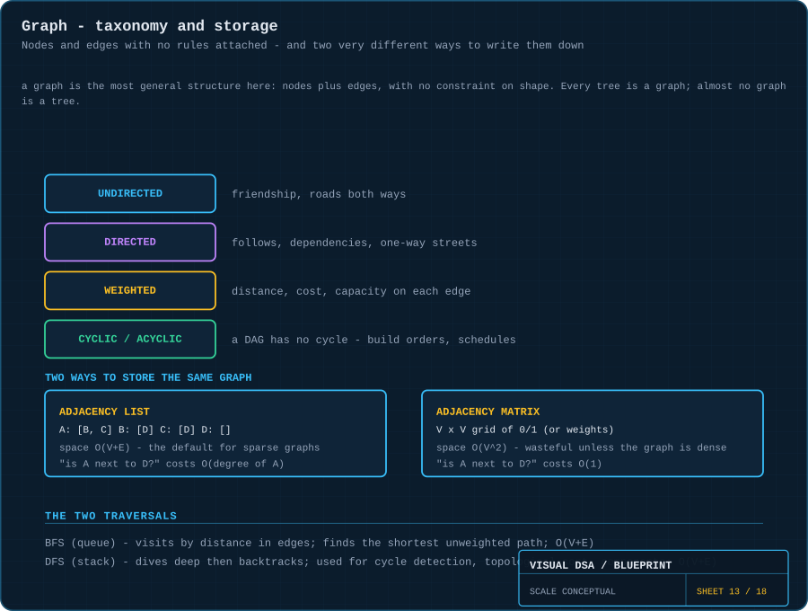
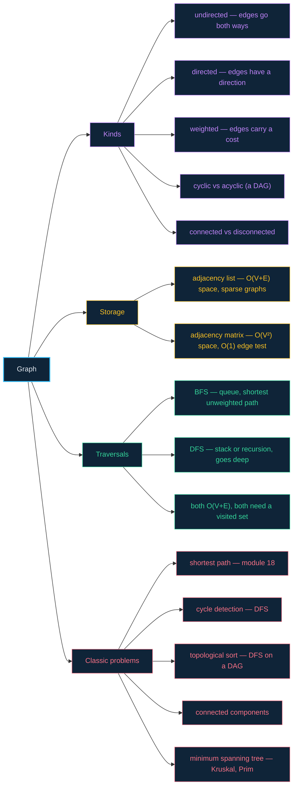

# 13 · Graphs — nodes and edges, with no rules attached

> **The analogy.** A map of friendships. There is no root, no hierarchy, no order. Anyone can know anyone, friendship can be one-way (a follow) or two-way, and you can absolutely get back to where you started. Every structure so far has been a graph with restrictions bolted on; a graph is what is left when you remove them all.

---

## 🎞️ Animations

**BFS — a ripple. Everything one edge away, then everything two edges away.**


**DFS — a maze walked with one hand on the wall. Commit, then unwind.**


---

## 🧠 Mental model

| Social network | Graph |
|:--|:--|
| a person | a **vertex** (node) |
| a friendship | an **edge** |
| "we are friends" | **undirected** edge |
| "I follow them, they do not follow me" | **directed** edge |
| how close two people live | a **weight** on the edge |
| a circle of mutual friends | a **cycle** |
| separate friend groups that never overlap | disconnected **components** |
| a tree is a graph | ...with no cycles and one path between any two nodes |

**Trees are graphs with rules.** A tree is a connected, acyclic graph. A linked list is a tree where each node has one child. Once you can think in graphs, everything earlier in the repo is a special case.

---

## 📐 Blueprint



---

## 🗺️ Mindmap



---

## ⚙️ Operations

**Storage — the choice you make first.**

```text
ADJACENCY LIST                          ADJACENCY MATRIX
A: [B, C]                                   A  B  C  D
B: [D]                                  A [ 0  1  1  0 ]
C: [D]                                  B [ 0  0  0  1 ]
D: []                                   C [ 0  0  0  1 ]
                                        D [ 0  0  0  0 ]

space   O(V + E)                        space   O(V²)
"is A adjacent to D?"   O(deg A)        "is A adjacent to D?"   O(1)
"list A's neighbours"   O(deg A)        "list A's neighbours"   O(V)
```

> **Rule of thumb:** real graphs are **sparse** — a social network has millions of users and a few hundred friends each, not millions. The adjacency list is the default; the matrix only wins when the graph is dense or you constantly test individual edges.

**BFS — the queue *is* the algorithm.**

```text
function bfs(start)
    visited ← set containing start          mark on ENQUEUE, not on dequeue
    Q ← queue containing start

    while Q is not empty do
        node ← dequeue(Q)
        visit(node)

        for each neighbour of node do
            if neighbour not in visited then
                add neighbour to visited
                enqueue(Q, neighbour)
            end
        end
    end
```

> **Mark on enqueue.** If you mark on dequeue instead, a node with two discovered paths gets enqueued twice and processed twice. On a dense graph that is the difference between `O(V+E)` and something much worse.

**DFS — swap the queue for a stack, change nothing else.**

```text
function dfs(start)
    visited ← empty set
    S ← stack containing start

    while S is not empty do
        node ← pop(S)
        if node in visited then continue end
        add node to visited
        visit(node)

        for each neighbour of node do
            if neighbour not in visited then push(S, neighbour) end
        end
    end
```

Or recursively, letting the call stack do the work:

```text
function dfs(node, visited)
    if node in visited then return end
    add node to visited
    visit(node)
    for each neighbour of node do
        dfs(neighbour, visited)
    end
```

**Shortest path in an *unweighted* graph — BFS gives it for free.**

```text
function shortestPath(start, target)
    visited ← set containing start
    prev ← empty map
    Q ← queue containing start

    while Q is not empty do
        node ← dequeue(Q)
        if node = target then return reconstruct(prev, target) end

        for each neighbour of node do
            if neighbour not in visited then
                add neighbour to visited
                prev[neighbour] ← node
                enqueue(Q, neighbour)
            end
        end
    end
    return "unreachable"
```

Because BFS finishes every node at distance `k` before touching distance `k+1`, the first time it reaches the target it has arrived by a shortest route. **This guarantee evaporates the moment edges have weights** — that is [Dijkstra's](18-dijkstra.md) job.

**Cycle detection in a directed graph — DFS with three colours.**

```text
function hasCycle(node, state)
    state[node] ← IN_PROGRESS
    for each neighbour of node do
        if state[neighbour] = IN_PROGRESS then return true end      a back edge
        if state[neighbour] = UNVISITED and hasCycle(neighbour, state) then return true end
    end
    state[node] ← DONE
    return false
```

Meeting a node that is still `IN_PROGRESS` means you have looped back onto your own current path. Meeting a `DONE` node is fine — that is just a shared subgraph.

---

## ⏱️ Complexity

`V` = vertices, `E` = edges.

| Operation | Adjacency list | Adjacency matrix |
|:--|:--:|:--:|
| space | **O(V + E)** | O(V²) |
| add edge | O(1) | O(1) |
| test "is `u` adjacent to `v`?" | O(deg u) | **O(1)** |
| iterate `u`'s neighbours | **O(deg u)** | O(V) |
| BFS / DFS (whole graph) | **O(V + E)** | O(V²) |

**Why `O(V + E)` for a traversal:** every vertex is dequeued exactly once (`V`) and every edge is examined exactly once from each endpoint (`E`). The `visited` set is what makes "exactly once" true.

---

## ⚖️ Trade-offs

| Use **BFS** when | Use **DFS** when |
|:--|:--|
| you need the shortest path in edges | you only need *some* path, quickly |
| the answer is likely close to the start | you are exploring the full structure |
| you are exploring level by level | you are detecting cycles or topologically sorting |
| the graph is deep — BFS will not blow the stack | the graph is very wide — DFS uses less memory |

> **Memory is the real difference.** BFS holds an entire frontier — up to `O(V)` on a wide graph. DFS holds one path — `O(depth)`. On a wide shallow graph DFS wins on memory; on a deep narrow graph recursive DFS risks a stack overflow and BFS is safer.

---

## 🃏 Flashcards

<details><summary>What single change turns BFS into DFS?</summary>

Replacing the **queue** with a **stack**. The traversal code is otherwise identical. FIFO explores by distance; LIFO explores by depth.
</details>

<details><summary>Why does every graph traversal need a visited set?</summary>

Because graphs may contain cycles. Without it, the traversal revisits nodes endlessly and never terminates. It is also what caps the total work at `O(V+E)`.
</details>

<details><summary>Adjacency list or adjacency matrix?</summary>

**List** for sparse graphs (nearly all real ones) — `O(V+E)` space and neighbour iteration proportional to actual degree. **Matrix** for dense graphs or when you constantly test single edges, where `O(1)` adjacency beats the `O(V²)` memory cost.
</details>

<details><summary>Why does BFS find the shortest path but only on unweighted graphs?</summary>

BFS expands strictly by *number of edges*, so it reaches a node for the first time via the fewest edges. With weights, fewest edges is no longer cheapest — a two-edge path costing 100 loses to a five-edge path costing 10. That needs Dijkstra.
</details>

<details><summary>How does DFS detect a cycle in a directed graph?</summary>

Three states. If DFS reaches a node currently marked `IN_PROGRESS`, it has found a **back edge** into its own active path — a cycle. Reaching a `DONE` node is harmless; that subgraph is simply shared.
</details>

<details><summary>What is a DAG and why does it matter?</summary>

A **Directed Acyclic Graph** — directed edges, no cycles. It is the structure of dependencies: build systems, task schedules, spreadsheet formulas, package managers. A DAG can be **topologically sorted** into a valid execution order; a graph with a cycle cannot, and that failure *is* your circular-dependency error.
</details>

---

## ❓ Quiz

**1.** You want the fewest connections between two people in a social network. BFS or DFS?

<details><summary>Answer</summary>

**BFS.** It expands by distance in edges, so the first time it reaches the target it has done so via the fewest hops. DFS might reach the same person by a 40-step detour and report that.
</details>

**2.** A graph has 1,000,000 vertices and each has about 10 edges. List or matrix?

<details><summary>Answer</summary>

**Adjacency list.** The matrix would need 10¹² cells — a terabyte of mostly zeros. The list needs about 10,000,000 entries. The graph is extremely sparse, which is the normal case.
</details>

**3.** Why mark a node visited when you enqueue it rather than when you dequeue it?

<details><summary>Answer</summary>

Because between enqueuing and dequeuing, other nodes may also discover it and enqueue it again. Marking on enqueue guarantees each node enters the queue exactly once, which is what keeps BFS at `O(V+E)`.
</details>

**4.** Your build system reports a circular dependency. What graph problem is that?

<details><summary>Answer</summary>

**Cycle detection in a directed graph.** The build order is a topological sort of a DAG; a cycle means no valid order exists, so the sort fails. DFS with the three-colour marking finds exactly which edge closes the loop.
</details>

---

⬅️ [12 · Tries](12-tries.md) · [🏠 Index](../README.md) · [14 · Searching](14-searching.md) ➡️
