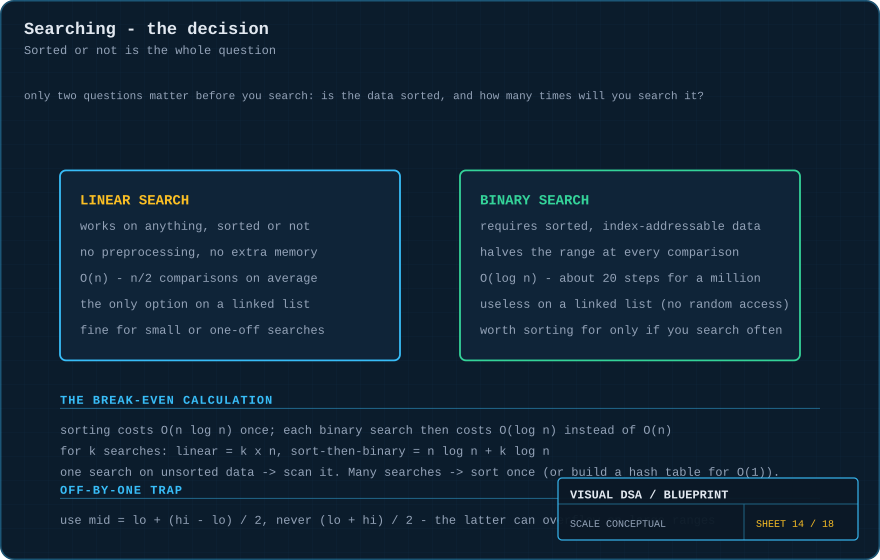
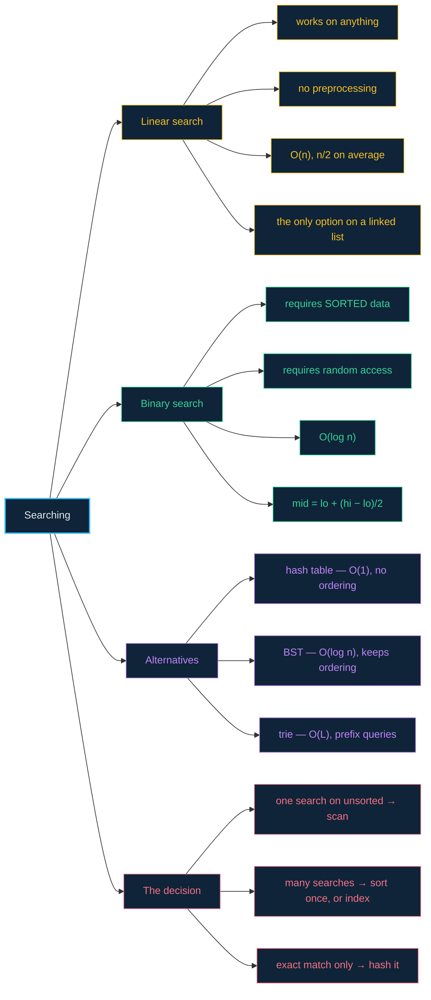

# 14 · Searching — one question decides everything

> **The analogy.** Finding a name in a phone book. If the book is a random pile of loose pages, you read every page. If it is bound and alphabetical, you open it in the middle and throw away half the book with one glance. Same goal, same data, wildly different cost — and the *only* thing that changed is whether it was sorted.

---

## 🎞️ Animations

**Linear search: no shortcut exists, so check them all.**


**Binary search: every guess deletes half of what remains.**


---

## 🧠 Mental model

| Phone book | Search |
|:--|:--|
| a pile of loose pages | unsorted data → **linear search** |
| a bound alphabetical book | sorted data → **binary search** |
| reading page by page | `O(n)` |
| opening in the middle and halving | `O(log n)` |
| alphabetising the pile first | sorting: `O(n log n)`, paid once |
| an index card catalogue that maps name → shelf | a [hash table](07-hash-tables.md): `O(1)` |

---

## 📐 Blueprint



---

## 🗺️ Mindmap



---

## ⚙️ Operations

**Linear search.**

```text
function linearSearch(A, target)
    for i ← 0 to A.length - 1 do
        if A[i] = target then return i end
    end
    return notFound                          n comparisons if it is absent
```

<!-- py:ops_search:linear_search -->
```python
def linear_search(values: list[Any], target: Any) -> int:
    """Works on anything, sorted or not. O(n), n/2 comparisons on average."""
    for i, v in enumerate(values):
        if v == target:
            return i
    return -1                             # n comparisons if it is absent
```
<!-- /py -->

**Binary search — the iterative form, which is the one to memorise.**

```text
function binarySearch(A, target)             A MUST be sorted
    lo ← 0
    hi ← A.length - 1

    while lo ≤ hi do                         ≤, not <: a one-element range is still valid
        mid ← lo + (hi - lo) / 2             NOT (lo + hi) / 2 — see below

        if A[mid] = target then
            return mid
        else if A[mid] < target then
            lo ← mid + 1                     +1, or you can loop forever
        else
            hi ← mid - 1
        end
    end

    return notFound
```

<!-- py:ops_search:binary_search -->
```python
def binary_search(values: list[Any], target: Any) -> int:
    """O(log n), but only on sorted, index-addressable data.

    Three classic bugs live in these seven lines - each marked below.
    """
    lo, hi = 0, len(values) - 1
    while lo <= hi:                       # BUG 1: `<` misses a one-element range
        mid = lo + (hi - lo) // 2         # BUG 2: (lo+hi)//2 overflows in
        if values[mid] == target:         #         fixed-width integer languages
            return mid
        if values[mid] < target:
            lo = mid + 1                  # BUG 3: without the +/-1 the range
        else:                             #         never shrinks and it loops
            hi = mid - 1                  #         forever
    return -1
```
<!-- /py -->

> **Three bugs live in those seven lines.**
> 1. `mid = (lo + hi) / 2` **overflows** on large arrays in fixed-width integer languages. `lo + (hi - lo) / 2` is arithmetically identical and cannot overflow. This exact bug survived for years in the Java standard library.
> 2. `while lo < hi` misses the case where the range has narrowed to exactly one element — which is where the answer usually is.
> 3. Forgetting the `±1` leaves `lo` or `hi` unchanged when `mid` equals them, and the loop never terminates.
>
> Binary search is famously easy to describe and famously hard to write correctly.

**The useful variant — first index not less than the target.**

```text
function lowerBound(A, target)               where target is, or where it would go
    lo ← 0
    hi ← A.length                            note: length, not length - 1

    while lo < hi do
        mid ← lo + (hi - lo) / 2
        if A[mid] < target then lo ← mid + 1 else hi ← mid end
    end

    return lo
```

<!-- py:ops_search:lower_bound -->
```python
def lower_bound(values: list[Any], target: Any) -> int:
    """First index whose value is not less than target.

    In other words: where the target is, or where it would go. This is what
    powers range queries and insertion into a sorted array.
    """
    lo, hi = 0, len(values)               # note: len, not len - 1
    while lo < hi:
        mid = lo + (hi - lo) // 2
        if values[mid] < target:
            lo = mid + 1
        else:
            hi = mid
    return lo
```
<!-- /py -->

This is what powers range queries, insertion into a sorted array, and "find the first entry after this timestamp".

Every Python function above is covered by [`examples/test_ops.py`](../examples/test_ops.py).

---

## ⏱️ Complexity

| Algorithm | Best | Average | Worst | Space | Requires |
|:--|:--:|:--:|:--:|:--:|:--|
| linear search | O(1) | O(n) | O(n) | O(1) | nothing |
| binary search (iterative) | O(1) | O(log n) | O(log n) | O(1) | sorted + random access |
| binary search (recursive) | O(1) | O(log n) | O(log n) | O(log n) | sorted + random access |
| hash lookup | O(1) | **O(1)** | O(n) | O(n) | a hash function |
| BST search | O(1) | O(log n) | O(n)\* | O(1) | \*O(log n) if balanced |

**What `O(log n)` buys you in real numbers:**

| Array size | Linear (worst) | Binary (worst) |
|--:|--:|--:|
| 1,000 | 1,000 | 10 |
| 1,000,000 | 1,000,000 | 20 |
| 1,000,000,000 | 1,000,000,000 | 30 |

A billionfold increase in data costs binary search **20 extra comparisons**.

---

## ⚖️ The break-even calculation

Sorting is not free. Decide with arithmetic, not instinct:

```text
k searches over n items

linear:              k × n
sort, then binary:   n log n  +  k log n
```

| Situation | Do this |
|:--|:--|
| one search, unsorted data | **scan it.** Sorting costs more than the search saves. |
| many searches, data mostly static | **sort once**, then binary search each time |
| many searches, exact match only | **build a hash table** — `O(1)` beats `O(log n)` |
| many searches, data changes constantly | **balanced BST** — keeps order without re-sorting |
| prefix queries | **trie** — see [module 12](12-tries.md) |

---

## 🃏 Flashcards

<details><summary>What is the one precondition for binary search?</summary>

**Sorted data with random access.** Both halves matter: sorted, so a comparison tells you which side to discard; random access, so reaching the middle is `O(1)`. A sorted linked list satisfies the first and fails the second.
</details>

<details><summary>Why <code>lo + (hi - lo) / 2</code> instead of <code>(lo + hi) / 2</code>?</summary>

`lo + hi` can overflow a fixed-width integer when both are large, producing a negative index and a crash. The alternative is algebraically identical and never exceeds `hi`. This exact bug survived for years in the Java standard library.
</details>

<details><summary>Binary search over a linked list — why not?</summary>

Reaching the middle costs `O(n)` hops instead of `O(1)`. You would pay `O(n)` per "halving", so the total is `O(n log n)` — worse than simply scanning the list once.
</details>

<details><summary>When does linear search beat binary search?</summary>

On unsorted data (binary search is not applicable at all), on very small arrays where the constant factors dominate, and when the target is usually near the front. Also on any structure without random access.
</details>

<details><summary>Hash lookup is O(1). Why ever use binary search?</summary>

Because a hash table has no order. Binary search works on a plain sorted array with zero extra memory, and generalises to `lowerBound`: range queries, nearest-neighbour, "the first record after this date". A hash table can answer none of those.
</details>

<details><summary>What does <code>lowerBound</code> return when the target is absent?</summary>

The index where it **would** be inserted to keep the array sorted — the first position holding a value not less than the target. That is what makes it useful for insertion and for range boundaries, not just membership.
</details>

---

## ❓ Quiz

**1.** You will search a 1,000,000-element unsorted array exactly once. Sort it first?

<details><summary>Answer</summary>

**No.** Sorting is ~20,000,000 operations to save at most 1,000,000. One search never justifies a sort. The break-even is around `k ≈ log n` searches.
</details>

**2.** Binary search on a 1,000,000-element array: worst-case comparisons?

<details><summary>Answer</summary>

**About 20**, since `log₂(1,000,000) ≈ 19.93`. Doubling the array to 2,000,000 adds exactly one.
</details>

**3.** Your binary search loops forever. What is the most likely cause?

<details><summary>Answer</summary>

A missing `±1`. If you write `lo ← mid` instead of `lo ← mid + 1`, then when `lo` and `hi` are adjacent, `mid` equals `lo` and nothing changes — the range never shrinks. (The other classic is `while lo < hi` when the loop body needs `≤`.)
</details>

**4.** You need "all records with a timestamp between T1 and T2", called constantly. What do you build?

<details><summary>Answer</summary>

A **sorted array with `lowerBound`** (if the data is static) or a **balanced BST** (if it changes). Both give `O(log n)` to find the range start, then a linear walk to its end. A hash table cannot answer this at all — it has destroyed the ordering.
</details>

---

⬅️ [13 · Graphs](13-graphs.md) · [🏠 Index](../README.md) · [15 · Sorting](15-sorting.md) ➡️
