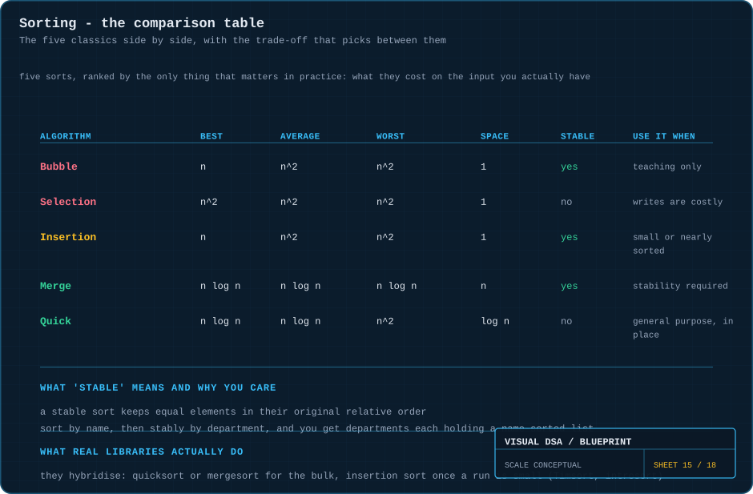
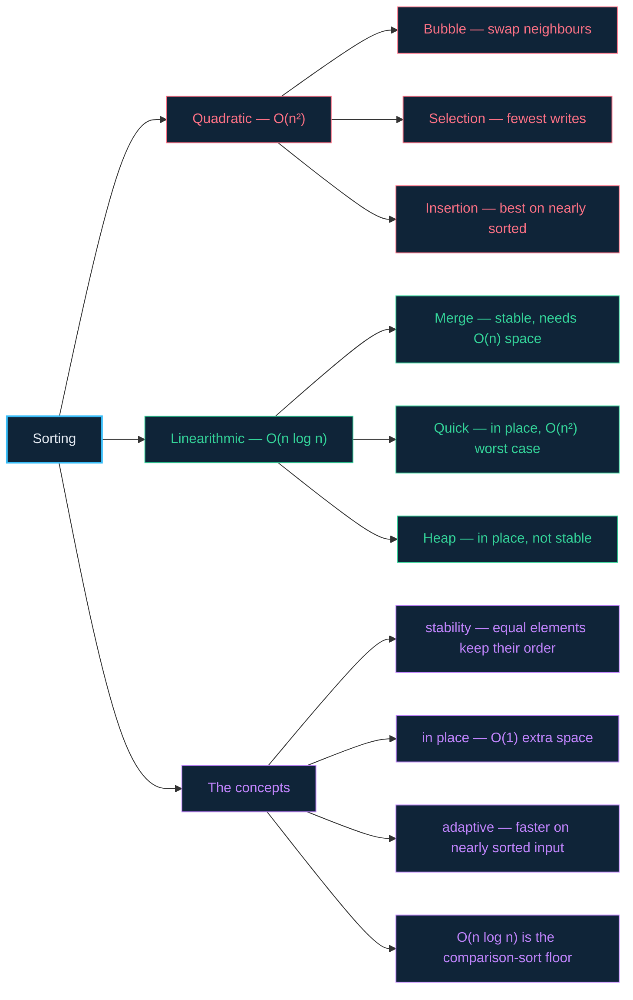

# 15 · Sorting — five algorithms, one trade-off table

> **The analogy.** Five people are handed the same shuffled deck. One only ever swaps neighbours. One scans for the lowest card each round. One builds a tidy run in their left hand. One splits the deck until the piles are single cards and merges them back. One picks a card and throws everything smaller to the left. All five finish sorted. They do not finish at the same time, and they do not need the same amount of table space.

---

## 🎞️ Animations

**Bubble — compare neighbours, swap, repeat.**


**Selection — find the minimum, place it, shrink the problem.**


**Insertion — how you actually sort a hand of cards.**


**Merge — split until trivial, then merge upward.**


**Quicksort — one pivot, two piles, and the pivot never moves again.**


---

## 🧠 Mental model

Each sort is a different person's instinct for tidying the same shuffled hand of cards.

| How a person would do it | The algorithm | What it costs them |
|:--|:--|:--|
| keep swapping any two neighbours that are the wrong way round, sweeping over and over | **bubble sort** | touches everything repeatedly — `O(n²)` |
| scan the whole remaining pile for the lowest card, put it down, repeat | **selection sort** | always `O(n²)` looks, but only `n` moves |
| hold a sorted run in your left hand and slide each new card into place | **insertion sort** | `O(n)` if the hand is nearly sorted already |
| split the deck until each pile is one card, then merge piles in order | **merge sort** | needs table space for the merge — `O(n)` |
| pick a card, throw everything smaller left and larger right, repeat on each side | **quicksort** | in place, but a bad pick costs `O(n²)` |

Three words decide between them, and they appear in every table below:

| Term | What it means | Why you would care |
|:--|:--|:--|
| **stable** | equal elements keep their original relative order | lets you sort by one key, then another, without losing the first |
| **in place** | needs only `O(1)` extra memory | matters when the data barely fits in memory as it is |
| **adaptive** | faster when the input is already nearly sorted | real-world data very often is |

---

## 📐 Blueprint



---

## 🗺️ Mindmap



---

## ⚙️ The five algorithms

### Bubble sort — the one you learn and then never use

```text
function bubbleSort(A)
    for pass ← 0 to A.length - 2 do
        swapped ← false

        for i ← 0 to A.length - 2 - pass do          the tail is already sorted
            if A[i] > A[i+1] then
                swap(A[i], A[i+1])
                swapped ← true
            end
        end

        if not swapped then return end               already sorted: O(n) best case
    end
```

Each pass floats the largest remaining value to the end, like a bubble rising. The `swapped` flag is the only thing that makes its best case `O(n)`.

### Selection sort — the fewest writes of any of them

```text
function selectionSort(A)
    for i ← 0 to A.length - 2 do
        minIndex ← i

        for j ← i+1 to A.length - 1 do
            if A[j] < A[minIndex] then minIndex ← j end
        end

        swap(A[i], A[minIndex])                      exactly ONE swap per pass
    end
```

Always `O(n²)` comparisons — there is no early exit — but only `O(n)` writes. That matters when a write is far more expensive than a read (flash memory, or huge records).

### Insertion sort — the one real libraries still use

```text
function insertionSort(A)
    for i ← 1 to A.length - 1 do
        key ← A[i]
        j ← i - 1

        while j ≥ 0 and A[j] > key do
            A[j+1] ← A[j]                            slide right to make room
            j ← j - 1
        end

        A[j+1] ← key
    end
```

If the array is already sorted the inner `while` never runs: `O(n)`. It is **adaptive**, **stable** and **in place**, which is why nearly every production sort switches to it once a partition gets small.

### Merge sort — the guaranteed one

```text
function mergeSort(A)
    if A.length ≤ 1 then return A end                a single element is sorted

    mid   ← A.length / 2
    left  ← mergeSort(A[0 .. mid-1])
    right ← mergeSort(A[mid .. end])
    return merge(left, right)

function merge(L, R)
    result ← empty
    i ← 0; j ← 0

    while i < L.length and j < R.length do
        if L[i] ≤ R[j] then                          ≤ , not < : this is what makes it STABLE
            append L[i] to result; i ← i + 1
        else
            append R[j] to result; j ← j + 1
        end
    end

    append the remainder of L and of R
    return result
```

`log n` levels of splitting, `O(n)` work merging each level → `O(n log n)`, **always**. The price is the `O(n)` merge buffer.

### Quicksort — the fastest in practice, with a caveat

```text
function quickSort(A, lo, hi)
    if lo ≥ hi then return end
    p ← partition(A, lo, hi)
    quickSort(A, lo, p - 1)                          the pivot itself is already final
    quickSort(A, p + 1, hi)

function partition(A, lo, hi)                        Lomuto scheme
    pivot ← A[hi]
    i ← lo - 1                                       boundary of the "smaller" region

    for j ← lo to hi - 1 do
        if A[j] ≤ pivot then
            i ← i + 1
            swap(A[i], A[j])
        end
    end

    swap(A[i+1], A[hi])                              drop the pivot into the boundary
    return i + 1
```

> **Why quicksort has an `O(n²)` worst case:** if the pivot is always the smallest or largest element, one partition is empty and the other has `n-1` elements — recursion depth `n` instead of `log n`. Feeding an already-sorted array to a last-element pivot does exactly this. **Randomising the pivot** (or median-of-three) makes that input astronomically unlikely, which is why real implementations always do it.

<!-- python:examples/algorithms.py:merge_sort,_merge,quick_sort,partition -->
#### 🐍 Python implementation

The `<=` in `_merge` is what makes merge sort stable:

<details open><summary><i>fold away</i></summary>

```python
def merge_sort(values: list[Any]) -> list[Any]:
    """O(n log n) guaranteed in every case, and stable -- at O(n) extra space."""
    if len(values) <= 1:
        return list(values)                  # a single element is sorted
    mid = len(values) // 2
    return _merge(merge_sort(values[:mid]), merge_sort(values[mid:]))


def _merge(left: list[Any], right: list[Any]) -> list[Any]:
    out: list[Any] = []
    i = j = 0
    while i < len(left) and j < len(right):
        if left[i] <= right[j]:              # <=, not <: this is what makes
            out.append(left[i])              # merge sort STABLE
            i += 1
        else:
            out.append(right[j])
            j += 1
    out.extend(left[i:])
    out.extend(right[j:])
    return out


def quick_sort(values: list[Any]) -> list[Any]:
    a = list(values)
    _quick(a, 0, len(a) - 1)
    return a


def partition(a: list[Any], lo: int, hi: int) -> int:
    """Lomuto. Everything <= the pivot is swapped to the front as it is met.

    A last-element pivot on sorted input is the O(n^2) worst case, which is
    why real implementations randomise the choice.
    """
    pivot = a[hi]
    i = lo - 1                               # boundary of the "smaller" region
    for j in range(lo, hi):
        if a[j] <= pivot:
            i += 1
            a[i], a[j] = a[j], a[i]
    a[i + 1], a[hi] = a[hi], a[i + 1]        # drop the pivot into the boundary
    return i + 1
```

Every line above is covered by [`examples/test_examples.py`](../examples/test_examples.py) — run it with `python3 -m unittest discover -s examples -t .`
</details>
<!-- /python -->

---

## ⏱️ Complexity

| Algorithm | Best | Average | Worst | Space | Stable | Adaptive |
|:--|:--:|:--:|:--:|:--:|:--:|:--:|
| **Bubble** | O(n) | O(n²) | O(n²) | O(1) | ✅ | ✅ |
| **Selection** | O(n²) | O(n²) | O(n²) | O(1) | ❌ | ❌ |
| **Insertion** | O(n) | O(n²) | O(n²) | O(1) | ✅ | ✅ |
| **Merge** | O(n log n) | O(n log n) | **O(n log n)** | **O(n)** | ✅ | ❌ |
| **Quick** | O(n log n) | O(n log n) | **O(n²)** | O(log n) | ❌ | ❌ |
| **Heap** | O(n log n) | O(n log n) | O(n log n) | **O(1)** | ❌ | ❌ |

**The three words in that table:**

- **Stable** — equal elements keep their original relative order. Sort by name, then *stably* by department, and each department is still name-sorted. An unstable sort destroys that.
- **In place** — `O(1)` extra memory. Merge sort is the notable exception at `O(n)`.
- **Adaptive** — faster on nearly-sorted input. Insertion sort's `O(n)` best case is why it survives in production.

---

## ⚖️ Choosing

| Situation | Use | Because |
|:--|:--|:--|
| general purpose, no constraints | **quicksort** (randomised) | fastest in practice, in place, cache-friendly |
| stability is required | **merge sort** | the only `O(n log n)` stable sort in the table |
| worst case must be bounded | **merge** or **heap** | quicksort's `O(n²)` is a real risk on adversarial input |
| memory is tight | **heapsort** | `O(n log n)` in `O(1)` space |
| nearly sorted already | **insertion sort** | genuinely `O(n)` on such input |
| fewer than ~20 elements | **insertion sort** | the `O(n log n)` constants dominate at that size |
| sorting integers in a small range | **counting / radix sort** | not comparison-based, so `O(n)` is allowed |

> **What real libraries ship:** hybrids. **Timsort** (Python, Java objects) is merge sort that detects already-sorted runs and uses insertion sort on short ones. **Introsort** (C++ `std::sort`) is quicksort that counts its recursion depth and switches to heapsort if it looks like it is heading for `O(n²)`. Nobody ships a textbook sort.

---

## 🃏 Flashcards

<details><summary>What does "stable" mean, with a concrete consequence?</summary>

Equal elements keep their input order. Sort employees by name, then stably by department: within each department the names are still sorted. With an unstable sort, that second pass scrambles the first — so you would have to sort by a composite key instead.
</details>

<details><summary>Why is quicksort usually faster than merge sort despite the same average complexity?</summary>

It sorts **in place** with excellent cache locality and a small constant factor. Merge sort allocates and copies through an `O(n)` buffer at every level. Same Big-O, very different constants.
</details>

<details><summary>What triggers quicksort's O(n²) worst case?</summary>

Consistently terrible pivots — the smallest or largest element each time. Handing an already-sorted array to a last-element-pivot implementation does this exactly. Randomising the pivot reduces the probability to negligible.
</details>

<details><summary>Why is insertion sort still used in production?</summary>

It is `O(n)` on nearly-sorted data and has tiny constants. Hybrid sorts (Timsort, introsort) switch to it for partitions below ~16–32 elements, where its low overhead beats any `O(n log n)` algorithm.
</details>

<details><summary>Why is O(n log n) the floor for comparison-based sorting?</summary>

There are `n!` possible orderings and each comparison yields one bit, so you need at least `log₂(n!) = Θ(n log n)` comparisons to identify which ordering you have. It is an information-theoretic bound, not an engineering limitation.
</details>

<details><summary>How can counting sort be O(n) then?</summary>

It never compares elements. It counts occurrences of each key and reconstructs the output from the counts, which only works when keys are integers from a bounded range. Its cost is `O(n + k)` for a key range `k`, so it loses badly when `k` is huge.
</details>

<details><summary>Selection sort is always O(n²). Why would anyone use it?</summary>

It performs exactly `n-1` swaps — the fewest of any sort here. When writes are dramatically more expensive than reads (wear-limited flash, or moving very large records), minimising writes can matter more than minimising comparisons.
</details>

---

## ❓ Quiz

**1.** You must sort 10,000,000 records and stability is required. Which sort?

<details><summary>Answer</summary>

**Merge sort** (or Timsort). It is the only `O(n log n)` stable option here. Quicksort is unstable and heapsort is unstable, so both would scramble equal keys.
</details>

**2.** An array is already sorted. Which of the five does the least work?

<details><summary>Answer</summary>

**Insertion sort** (and bubble sort with the early-exit flag) — both are `O(n)`, doing a single verifying pass. Merge sort still does its full `O(n log n)`, and a last-element-pivot quicksort hits its `O(n²)` worst case on this exact input.
</details>

**3.** Why do production libraries randomise the quicksort pivot?

<details><summary>Answer</summary>

To make the `O(n²)` case depend on chance rather than on the input. Without randomisation, an attacker (or just a sorted input) reliably triggers quadratic behaviour — a genuine denial-of-service vector, not a theoretical concern.
</details>

**4.** You are sorting 12 integers inside a hot loop. Which sort?

<details><summary>Answer</summary>

**Insertion sort.** At `n = 12` the `O(n log n)` algorithms' constants and recursion overhead dominate; insertion sort's tight inner loop wins outright. This is precisely the threshold every hybrid sort switches at.
</details>

---

⬅️ [14 · Searching](14-searching.md) · [🏠 Index](../README.md) · [16 · Recursion & backtracking](16-recursion-and-backtracking.md) ➡️
