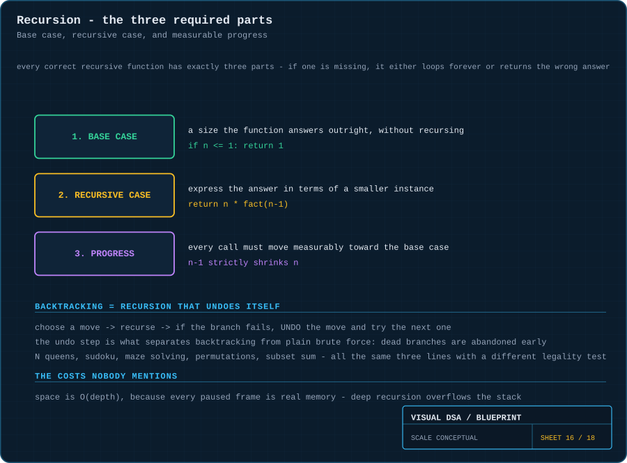
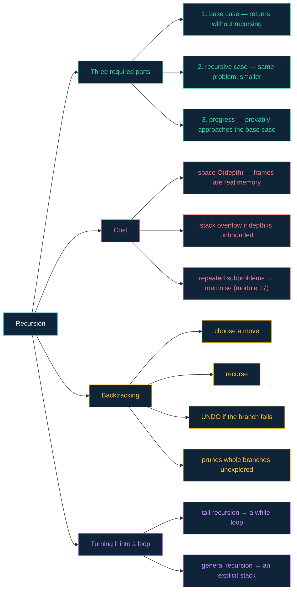

# 16 · Recursion & backtracking — a stack of paused promises

> **The analogy.** Russian dolls. To close the outermost doll you must first close the one inside it, and to close that one you must close the one inside *that*. Nothing actually closes until you reach the smallest doll — which closes on its own, because there is nothing inside it. That smallest doll is the **base case**, and without it the nesting never ends.

---

## 🎞️ Animations

**Recursion: nothing is computed on the way down. Everything happens on the way back up.**


**Backtracking: try, fail, undo, try the next — and abandon whole branches unexplored.**


---

## 🧠 Mental model

| Russian dolls | Recursion |
|:--|:--|
| a doll waiting on the one inside it | a **paused stack frame** |
| the smallest doll, which needs nobody | the **base case** |
| each doll being strictly smaller | **progress** toward the base case |
| closing them from the inside out | the stack **unwinding** with return values |
| a doll containing a doll the same size | **infinite recursion** → stack overflow |

**Recursion is not magic and it is not a loop.** It is a stack of function calls, each one suspended in real memory, each waiting on the result of the one below it. The [stack](05-stacks.md) module is the prerequisite for this one.

---

## 📐 Blueprint



---

## 🗺️ Mindmap



---

## ⚙️ Operations

**The template every recursive function fits.**

```text
function solve(problem)
    if problem is small enough then          1. BASE CASE
        return the answer directly
    end

    smaller ← reduce(problem)                3. PROGRESS — must strictly shrink
    return combine(solve(smaller))           2. RECURSIVE CASE
```

Miss part 1 and it never stops. Miss part 3 and it never stops *even with* a base case, because it never reaches it.

**Factorial — the smallest complete example.**

```text
function factorial(n)
    if n ≤ 1 then return 1 end               base case
    return n × factorial(n - 1)              recursive case, n-1 is progress
```

The call `factorial(4)` builds four stack frames before a single multiplication happens. Then `1`, `2`, `6`, `24` come back up.

**Tree traversal — where recursion is genuinely the clearest code.**

```text
function inOrder(node)
    if node = null then return end           base case: an empty tree
    inOrder(node.left)                       each subtree is a smaller instance
    visit(node)
    inOrder(node.right)
```

Writing this iteratively requires you to build and manage the stack yourself. Here the base case is simply "the tree ran out", and progress is guaranteed because subtrees are strictly smaller.

**Backtracking — recursion plus one extra line.**

```text
function backtrack(state)
    if state is a complete solution then
        record(state)
        return
    end

    for each candidate move from state do
        if not legal(state, move) then continue end     ← the pruning happens HERE

        apply(state, move)                              choose
        backtrack(state)                                explore
        undo(state, move)                               ← UNCHOOSE. This is backtracking.
    end
```

> **The `undo` line is the entire difference from brute force.** Brute force enumerates every arrangement and tests each one. Backtracking abandons a partial arrangement the instant it becomes illegal — discarding every completion of it, unexamined. For 8 queens that is the difference between 4,426,165,368 arrangements and about 2,000 explored states.

**N queens — the canonical instance.**

```text
function placeQueens(board, row)
    if row = board.size then return true end            all rows filled: solved

    for col ← 0 to board.size - 1 do
        if isSafe(board, row, col) then
            board[row] ← col                            place
            if placeQueens(board, row + 1) then return true end
            board[row] ← empty                          remove — try the next column
        end
    end

    return false                                        no legal column: tell the caller
```

Returning `false` is what causes the *caller's* loop to advance to its next column — that is the backtrack step propagating upward.

**Converting recursion to iteration.**

```text
tail recursion — the recursive call is the last thing done:

    function sumTo(n, acc)                      function sumTo(n)
        if n = 0 then return acc end                acc ← 0
        return sumTo(n - 1, acc + n)      →         while n > 0 do
                                                        acc ← acc + n; n ← n - 1
                                                    end
                                                    return acc

general recursion — build the stack yourself:

    push the initial state
    while the stack is not empty do
        pop a state, process it, push its sub-states
    end
```

---

<!-- python:examples/algorithms.py:factorial,solve_n_queens -->
<details><summary><b>🐍 Python implementation</b></summary>

The `placed.pop()` is the whole difference from brute force:

```python
def factorial(n: int) -> int:
    """Base case, recursive case, and progress -- all three are required."""
    if n <= 1:
        return 1                             # base case: returns without recursing
    return n * factorial(n - 1)              # n-1 is the progress


def solve_n_queens(n: int = 4) -> list[list[int]]:
    """Backtracking: choose, recurse, and UNDO when the branch cannot work.

    The undo is the whole difference from brute force -- it abandons every
    completion of an illegal prefix without ever generating them.
    """
    solutions: list[list[int]] = []
    placed: list[int] = []                   # placed[row] = column

    def safe(row: int, col: int) -> bool:
        return all(c != col and abs(r - row) != abs(c - col)
                   for r, c in enumerate(placed))

    def place(row: int) -> None:
        if row == n:
            solutions.append(placed.copy())
            return
        for col in range(n):
            if safe(row, col):
                placed.append(col)           # choose
                place(row + 1)               # explore
                placed.pop()                 # UNCHOOSE -- this is backtracking

    place(0)
    return solutions
```

Tested in [`examples/test_examples.py`](../examples/test_examples.py). Run the suite with `python3 -m unittest discover -s examples -t .`
</details>
<!-- /python -->

---

## ⏱️ Complexity

| Function | Time | Space | Note |
|:--|:--:|:--:|:--|
| `factorial(n)` | O(n) | **O(n)** | `n` pending frames |
| tree traversal | O(n) | O(height) | `O(log n)` balanced, `O(n)` degenerate |
| naive `fib(n)` | **O(2ⁿ)** | O(n) | the same subproblems, over and over — see [module 17](17-paradigms.md) |
| memoised `fib(n)` | O(n) | O(n) | each subproblem solved once |
| N queens | O(n!) worst | O(n) | pruning makes the practical cost far lower |
| binary search (recursive) | O(log n) | O(log n) | the iterative version is `O(1)` space |

> **Space is the cost people forget.** Every paused frame holds its parameters, locals and return address in real memory. `O(depth)` space is not an abstraction — exceed the stack and the process dies. A recursive traversal of a degenerate 1,000,000-node tree will overflow; the iterative version will not.

---

## ⚖️ Trade-offs

| ✅ Use recursion when | ❌ Avoid recursion when |
|:--|:--|
| the problem is defined recursively (trees, nested structures) | the depth could be large or unbounded |
| a divide-and-conquer split is natural | a simple loop is just as clear |
| backtracking is required — the undo is nearly free | the same subproblems repeat (memoise, or go bottom-up) |
| the recursive code is dramatically clearer | you are in a hot loop and call overhead matters |

---

## 🃏 Flashcards

<details><summary>What are the three parts every correct recursive function needs?</summary>

**Base case** (returns without recursing), **recursive case** (the same problem, smaller), and **progress** (each call provably moves toward the base case). Missing the base case loops forever; missing progress loops forever *despite* having one.
</details>

<details><summary>What actually causes a stack overflow?</summary>

Too many simultaneously pending frames. Either the recursion never terminates, or it legitimately goes deeper than the fixed-size call stack allows. Each frame holds parameters, locals and a return address — this is real memory, not a metaphor.
</details>

<details><summary>What is the single line that separates backtracking from brute force?</summary>

The **undo** after the recursive call. It lets you abandon a partial solution the moment it becomes illegal, discarding every completion of it without ever generating them.
</details>

<details><summary>Why is naive recursive fibonacci O(2ⁿ)?</summary>

Because `fib(n)` calls `fib(n-1)` and `fib(n-2)`, which recompute the same values independently. `fib(3)` is evaluated many separate times in one call tree. The subproblems **overlap**, which is the signal to memoise — see [module 17](17-paradigms.md).
</details>

<details><summary>Is recursion always convertible to iteration?</summary>

**Yes**, always. Tail recursion becomes a simple loop. General recursion becomes a loop plus an explicit stack — you take over the bookkeeping the language was doing for you. Nothing is computable recursively that is not computable iteratively.
</details>

<details><summary>Why does DFS have a natural recursive form but BFS not?</summary>

DFS's exploration order is exactly the call stack's order — recursion gives you the stack for free. BFS needs a **queue**, and the call stack is not a queue, so BFS must manage its own structure explicitly.
</details>

---

## ❓ Quiz

**1.** `function f(n) { return n × f(n-1) }` — what is wrong?

<details><summary>Answer</summary>

**No base case.** It recurses forever (through negative numbers) until the stack overflows. It needs `if n ≤ 1 then return 1 end` at the top.
</details>

**2.** A recursive function has a correct base case but still never terminates. Why?

<details><summary>Answer</summary>

**No progress.** Something like `f(n)` calling `f(n)` unchanged, or recursing on `n/2` with *floating-point* division — `n` halves forever, gets arbitrarily small, and never actually reaches the `n = 0` base case. A base case is only reachable if every call strictly moves toward it.
</details>

**3.** In N queens, you find that no column in row 2 is safe. What happens next?

<details><summary>Answer</summary>

The function returns `false`, which resumes the **row-1** call's loop at its next column. Row 1's queen moves, and row 2 is re-attempted from scratch against the new configuration. That unwind-and-retry *is* the backtrack.
</details>

**4.** You must traverse a linked list of 10,000,000 nodes. Recursive or iterative?

<details><summary>Answer</summary>

**Iterative.** The recursive version needs 10,000,000 simultaneous stack frames and will overflow long before finishing. The iterative version uses `O(1)` space. Recursion depth must always be something you can bound.
</details>

---

⬅️ [15 · Sorting](15-sorting.md) · [🏠 Index](../README.md) · [17 · Paradigms](17-paradigms.md) ➡️
