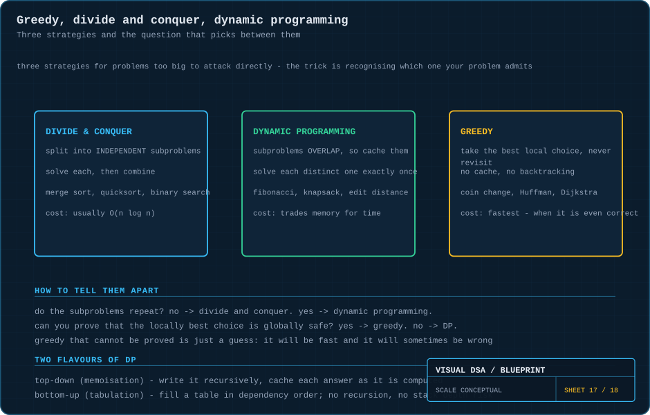
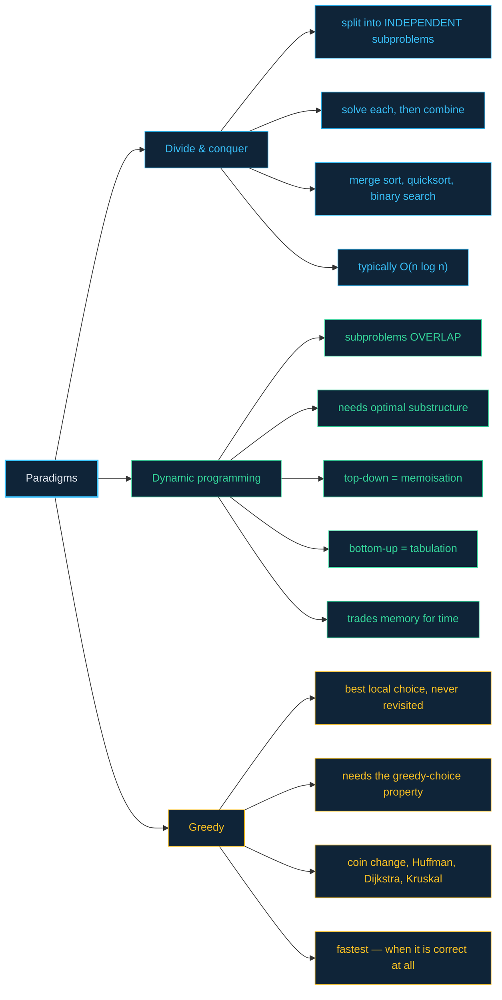

# 17 · Paradigms — greedy, divide & conquer, dynamic programming

> **The analogy.** Three ways to cross a country you have never seen. **Greedy:** at every junction take the road that looks best right now, and never turn back. **Divide and conquer:** cut the journey into independent legs, have someone solve each, then stitch the routes together. **Dynamic programming:** notice you keep re-planning the same stretch of motorway, so write that stretch down once and look it up forever after.

---

## 🎞️ Animations

**Divide and conquer — divide, conquer, combine.**


**Dynamic programming — an exponential call tree becomes a linear table.**


**Greedy — take the biggest bite that fits, and never reconsider.**


---

## 🧠 Mental model

| Question about your problem | Answer | Paradigm |
|:--|:--|:--|
| do the subproblems repeat? | **no** | divide and conquer |
| do the subproblems repeat? | **yes** | dynamic programming |
| can you *prove* the locally best choice is globally safe? | **yes** | greedy |
| can you prove it? | **no** | dynamic programming, not greedy |

That third row is the one people get wrong. A greedy algorithm you have not proved correct is not an algorithm — it is a guess that happens to be fast.

---

## 📐 Blueprint



---

## 🗺️ Mindmap



---

## ⚙️ Divide and conquer

```text
function solve(problem)
    if problem is small enough then
        return solveDirectly(problem)                   the base case
    end

    parts ← divide(problem)                             1. DIVIDE
    answers ← empty list
    for each part in parts do
        append solve(part) to answers                   2. CONQUER
    end
    return combine(answers)                             3. COMBINE
```

**The requirement:** the subproblems must be **independent**. Merge sort's two halves know nothing about each other; that is what makes recursing on both safe and non-redundant.

**Where the complexity comes from:** splitting in half gives `log n` levels; doing `O(n)` work per level gives `O(n log n)`. That is merge sort, and it is why so many divide-and-conquer algorithms land on the same figure.

---

## ⚙️ Dynamic programming

**The problem it solves — visible in one comparison.**

```text
NAIVE                                       fib(5)
                                           /      \
                                     fib(4)        fib(3)      ← recomputed
                                    /     \        /    \
                              fib(3)   fib(2)  fib(2)  fib(1)  ← recomputed
                              /   \
                        fib(2)   fib(1)                        ← recomputed

O(2ⁿ) calls, and almost all of them recompute a value already known.
```

**Top-down — memoisation. Write the recursion, then cache it.**

```text
function fib(n, memo)
    if n ≤ 1 then return n end
    if memo has n then return memo[n] end               ← the entire technique
    memo[n] ← fib(n-1, memo) + fib(n-2, memo)
    return memo[n]
```

Two lines added to the naive version take it from `O(2ⁿ)` to `O(n)`. Each distinct subproblem is now computed exactly once.

**Bottom-up — tabulation. No recursion at all.**

```text
function fib(n)
    table ← array of size n+1
    table[0] ← 0
    table[1] ← 1                                        the base cases, seeded

    for i ← 2 to n do
        table[i] ← table[i-1] + table[i-2]              dependencies already computed
    end

    return table[n]
```

And once you see that only the last two entries are ever read, the table collapses:

```text
function fib(n)                                         O(1) space
    a ← 0; b ← 1
    for i ← 2 to n do
        a, b ← b, a + b
    end
    return b
```

**The two conditions DP requires:**

1. **Overlapping subproblems** — the same subproblem is asked more than once. (No overlap → use divide and conquer; caching would just waste memory.)
2. **Optimal substructure** — an optimal solution is built from optimal solutions to subproblems. (Without this, caching sub-answers tells you nothing about the whole.)

---

## ⚙️ Greedy

```text
function greedy(problem)
    solution ← empty
    while problem is not solved do
        choice ← the best-looking option right now             never reconsidered
        add choice to solution
        reduce problem by choice
    end
    return solution
```

**When it works — coin change with a sensible coin system.**

```text
coins 25, 10, 5, 1 — make 63

take 25 → 38 left
take 25 → 13 left
take 10 →  3 left
take 1, 1, 1 → 0

six coins, and that is provably optimal for THIS coin system
```

**When it fails — change one thing.**

```text
coins 1, 3, 4 — make 6

greedy: 4 + 1 + 1 = three coins
best:   3 + 3     = two coins

greedy loses. Same algorithm, different coin set, wrong answer.
```

> **This is the whole lesson.** Greedy correctness is a property of the *problem*, never of the algorithm. Changing the coin denominations broke it without touching a line of code. If you cannot prove the greedy-choice property holds, you must use DP — which considers every combination and cannot be fooled.

**Greedy algorithms that *are* proved correct:** [Dijkstra](18-dijkstra.md) (with non-negative weights), Kruskal's and Prim's minimum spanning trees, Huffman coding, activity selection by earliest finish time.

---

## ⏱️ Complexity

| Paradigm | Typical time | Typical space | Failure mode |
|:--|:--:|:--:|:--|
| divide & conquer | O(n log n) | O(log n) – O(n) | wasted work if subproblems overlap |
| DP (memoised) | O(states) | O(states) | memory blowup; recursion depth |
| DP (tabulated) | O(states) | O(states), often reducible | you must know the fill order |
| greedy | O(n) or O(n log n) | O(1) | **silently returns a wrong answer** |

**Fibonacci, three ways:**

| Approach | Time | Space |
|:--|:--:|:--:|
| naive recursion | O(2ⁿ) | O(n) |
| memoised | O(n) | O(n) |
| tabulated | O(n) | O(n) |
| tabulated, two variables | **O(n)** | **O(1)** |

---

## ⚖️ Choosing

| If your problem… | Use |
|:--|:--|
| splits into independent halves | **divide & conquer** |
| re-asks the same subproblem repeatedly | **dynamic programming** |
| has a provable greedy-choice property | **greedy** — it will be the fastest |
| looks greedy but you cannot prove it | **dynamic programming** |
| has no structure to exploit at all | brute force, and reduce the search space |

> **How to spot a DP problem in the wild:** it asks for a maximum, minimum or count of ways; the answer for `n` depends on answers for smaller `n`; and a naive recursion would obviously repeat work. Knapsack, edit distance, longest common subsequence, coin change (the general case), and grid path counting all fit.

---

## 🃏 Flashcards

<details><summary>What distinguishes divide & conquer from dynamic programming?</summary>

**Whether the subproblems overlap.** Divide and conquer splits into *independent* pieces — caching would gain nothing. DP applies when the same subproblem recurs, so solving it once and storing it is the whole win.
</details>

<details><summary>Memoisation vs tabulation?</summary>

Both are DP. **Memoisation** is top-down: write the natural recursion and cache results — easy, and only computes states you actually need. **Tabulation** is bottom-up: fill a table in dependency order — no recursion, no stack-depth risk, and easier to optimise the space away.
</details>

<details><summary>What are the two conditions for DP to apply?</summary>

**Overlapping subproblems** and **optimal substructure**. Without overlap, caching is pointless. Without optimal substructure, an optimal whole cannot be assembled from optimal parts, so the sub-answers you cached are not usable.
</details>

<details><summary>Coins 1, 3, 4 and a target of 6 — what does greedy do and why is it wrong?</summary>

Greedy takes 4, then 1, then 1 — three coins. The optimum is 3 + 3, two coins. Taking the largest coin first is not safe in this coin system, and greedy has no mechanism to reconsider. DP finds the two-coin answer.
</details>

<details><summary>Why is Dijkstra called greedy, and why is it correct?</summary>

At each step it settles the cheapest unsettled node and never revisits it. That is correct because with **non-negative** weights, no later path can undercut a distance that is already the smallest remaining — the greedy choice is provably safe. Add a negative edge and the proof collapses.
</details>

<details><summary>DP turned an O(2ⁿ) algorithm into O(n). What did it cost?</summary>

**Memory** — `O(n)` for the table. DP is the canonical time-for-space trade. Sometimes the space can be reduced afterwards, as the two-variable Fibonacci shows, when only a fixed window of the table is ever read.
</details>

---

## ❓ Quiz

**1.** Merge sort's two halves never share subproblems. So which paradigm, and would memoisation help?

<details><summary>Answer</summary>

**Divide and conquer**, and memoisation would **not** help — it would add a cache that never gets a hit, wasting memory and time. Caching only pays when subproblems recur.
</details>

**2.** You write a recursive solution and notice it computes `solve(3)` hundreds of times. What is the fix?

<details><summary>Answer</summary>

**Memoise it.** Add a cache keyed by the arguments, return early on a hit. Repeated identical subproblems is the definitive signal for DP, and top-down memoisation is usually a two-line change.
</details>

**3.** Greedy and DP both solve your problem. Which do you ship?

<details><summary>Answer</summary>

**Greedy — if and only if you have proved the greedy-choice property.** It is faster and uses less memory. Without the proof, ship DP: a fast wrong answer is worse than a slower right one.
</details>

**4.** Why is naive Fibonacci exponential when it only ever computes `n` distinct values?

<details><summary>Answer</summary>

Because it computes those `n` values an exponential number of *times*. Each call spawns two more, and nothing remembers previous results, so the call tree grows as `2ⁿ` while containing only `n` distinct answers. That gap between distinct subproblems and total calls is exactly what DP eliminates.
</details>

---

⬅️ [16 · Recursion & backtracking](16-recursion-and-backtracking.md) · [🏠 Index](../README.md) · [18 · Dijkstra](18-dijkstra.md) ➡️
