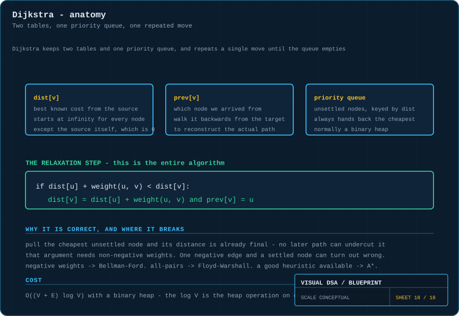
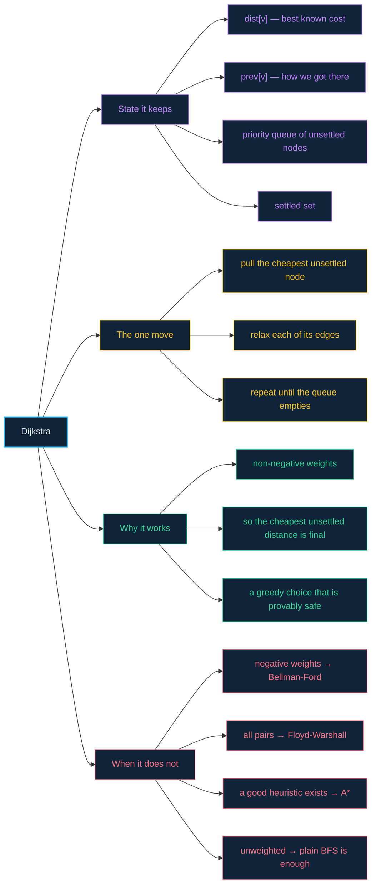

# 18 · Dijkstra — cheapest first, not nearest first

> **The analogy.** A road atlas where every road has a length. [BFS](13-graphs.md) would find the route with the fewest junctions, which is useless if one of those roads is a 400 km detour. Dijkstra instead always expands from whichever place is currently cheapest to reach — so the first time it arrives anywhere, it has arrived by the cheapest possible route.

---

## 🎞️ Animation


Watch the numbers above each node. They start at infinity, get improved ("relaxed") as cheaper routes are discovered, and freeze the moment the node is settled.

---

## 🧠 Mental model

| Road atlas | Dijkstra |
|:--|:--|
| a town | a vertex |
| a road with a length | a weighted edge |
| "the best route I know of so far to town X" | `dist[X]` |
| "I have not found any route to X yet" | `dist[X] = ∞` |
| "which unvisited town is cheapest to reach?" | the priority queue's next item |
| "I found a shorter way to X" | a **relaxation** |
| "this town's best route is now final" | the node is **settled** |
| retracing the route backwards from the destination | walking the `prev` map |

**Why "cheapest first" is the whole idea:** if the nearest unsettled town is 5 km away, no route through any *other* unsettled town could reach it in less — every one of those is already further than 5 km away, and roads cannot have negative length. So 5 km is final. That argument is the correctness proof, and it depends entirely on the last clause.

---

## 📐 Blueprint



---

## 🗺️ Mindmap



---

## ⚙️ The algorithm

**Relaxation — this single `if` is the whole algorithm.**

```text
if dist[u] + weight(u, v) < dist[v] then
    dist[v] ← dist[u] + weight(u, v)         a cheaper route to v exists
    prev[v] ← u                              remember how we got there
end
```

<!-- py:ops_dijkstra:relax -->
```python
def relax(dist: dict, prev: dict, u: Hashable, v: Hashable, weight: float) -> bool:
    """The whole algorithm is this one comparison.

    'Does going via u beat the best route to v that I already know?'
    """
    if dist[u] + weight < dist[v]:
        dist[v] = dist[u] + weight        # a cheaper route to v exists
        prev[v] = u                       # remember how we got there
        return True
    return False
```
<!-- /py -->

"Relaxing" an edge means: *does going via `u` beat the best route to `v` I already know?* Everything else is bookkeeping to make sure each edge gets relaxed at the right time.

**The full algorithm.**

```text
function dijkstra(graph, source)
    for each vertex v in graph do
        dist[v] ← ∞
        prev[v] ← null
    end
    dist[source] ← 0

    PQ ← priority queue containing (0, source)
    settled ← empty set

    while PQ is not empty do
        (d, u) ← extractMin(PQ)                  the cheapest unsettled node

        if u in settled then continue end        a stale queue entry — skip it
        add u to settled                         dist[u] is now FINAL

        for each edge (u, v, w) in graph do
            if v in settled then continue end

            if dist[u] + w < dist[v] then
                dist[v] ← dist[u] + w
                prev[v] ← u
                insert (dist[v], v) into PQ      the old entry for v is now stale
            end
        end
    end

    return dist, prev
```

<!-- py:ops_dijkstra:dijkstra -->
```python
def dijkstra(adj: dict, source: Hashable) -> tuple[dict, dict]:
    """Cheapest first, not nearest first.

    Pulling the cheapest unsettled node makes its distance final: any other
    route runs through a node already at least as expensive, and non-negative
    edges cannot reduce a total. One negative edge and that argument
    collapses - it will not error, it will quietly return a wrong answer.
    """
    if any(w < 0 for u in adj for _, w in adj[u]):
        raise ValueError("Dijkstra requires non-negative weights")

    dist = {v: INFINITY for v in adj}
    prev: dict = {v: None for v in adj}
    dist[source] = 0.0
    settled = set()
    pq = [(0.0, source)]

    while pq:
        d, u = heapq.heappop(pq)          # the cheapest unsettled node
        if u in settled:
            continue                      # a stale entry: skip it
        settled.add(u)                    # dist[u] is now FINAL
        for v, w in adj.get(u, []):
            if v not in settled and relax(dist, prev, u, v, w):
                heapq.heappush(pq, (dist[v], v))
    return dist, prev
```
<!-- /py -->

> **Why "stale entries" instead of updating the queue?** A binary heap cannot cheaply find and update an arbitrary element. The standard trick is to push a *new* entry with the better distance and simply skip any entry whose node is already settled. It is simpler, and the extra entries are bounded by `E`.

**Reconstructing the actual path — this is what `prev` is for.**

```text
function path(prev, target)
    route ← empty list
    node ← target

    while node ≠ null do
        prepend node to route
        node ← prev[node]                        walk backwards to the source
    end

    return route
```

<!-- py:ops_dijkstra:path_to -->
```python
def path_to(prev: dict, target: Hashable) -> list:
    """dist gives you the cost; only prev gives you the route."""
    out = []
    node: Optional[Hashable] = target
    while node is not None:
        out.append(node)
        node = prev.get(node)
    return out[::-1]                      # walk backwards, then reverse
```
<!-- /py -->

`dist` tells you the *cost*; only `prev` tells you the *route*. Forgetting to maintain it is the most common way to end up with a correct number and no answer.

**A worked trace** — the graph in the animation, source `A`, target `G`:

| Settled | `dist` after relaxing |
|:--|:--|
| — | A=0, all others ∞ |
| **A** (0) | B=4, C=2 |
| **C** (2) | E=5, F=10 |
| **B** (4) | D=9. E via B would be 14 → **rejected**, 5 already stands |
| **E** (5) | G=11 |
| **D** (9) | G via D would be 13 → rejected |
| **F** (10) | G via F would be 12 → rejected |
| **G** (11) | done |

Shortest path: **A → C → E → G**, cost **11**. Note it uses three edges, while `A → B → D → G` also uses three but costs 13 — BFS could have returned either.

Every Python function above is covered by [`examples/test_ops.py`](../examples/test_ops.py).

---

## ⏱️ Complexity

| Priority queue | Time | When |
|:--|:--:|:--|
| binary heap | **O((V + E) log V)** | the standard choice |
| unsorted array | O(V²) | dense graphs, where `E ≈ V²` |
| Fibonacci heap | O(E + V log V) | theoretically best, rarely worth it in practice |

**Where the `log V` comes from:** every settle is one `extractMin` and every successful relaxation is one `insert`. Both are `O(log V)` on a binary heap, and there are `O(V)` settles and `O(E)` relaxations.

**Space:** `O(V)` for `dist`, `prev` and `settled`, plus `O(E)` worst case for queue entries.

---

## ⚖️ When to use something else

| Situation | Use | Why Dijkstra fails |
|:--|:--|:--|
| all edges have the same weight | **BFS** | Dijkstra's priority queue is pure overhead |
| some edges are negative | **Bellman-Ford** | a settled distance can turn out to be wrong |
| negative cycles exist | **Bellman-Ford** (detects them) | no shortest path exists at all |
| you need every pair of distances | **Floyd-Warshall** | running Dijkstra `V` times is often worse |
| you have a good distance heuristic | **A\*** | Dijkstra explores in all directions equally |
| the graph is a DAG | **topological sort + relax** | linear time, and negative weights are fine |

> **Why one negative edge breaks it.** Dijkstra settles a node and never looks at it again. With a negative edge, a longer-looking path can later become cheaper — but by then the node is settled and the algorithm will not reconsider. It does not error; it returns a wrong answer confidently.

---

## 🃏 Flashcards

<details><summary>What is edge relaxation?</summary>

Checking whether routing through `u` gives a cheaper path to `v` than the best one currently known: `if dist[u] + w(u,v) < dist[v]` then update `dist[v]` and `prev[v]`. Every step of Dijkstra is either a settle or a relaxation.
</details>

<details><summary>Why does Dijkstra always pick the cheapest unsettled node?</summary>

Because that distance is provably final. Any alternative route would have to pass through another unsettled node, all of which are already at least as expensive — and with non-negative weights, adding edges can never reduce the total. So no cheaper route can exist.
</details>

<details><summary>What breaks with negative edge weights?</summary>

The finality argument. A negative edge means adding an edge can *lower* a total, so a node settled early may later have a cheaper route discovered — but Dijkstra never revisits settled nodes. Use Bellman-Ford, which relaxes every edge `V−1` times and can also detect negative cycles.
</details>

<details><summary>What is <code>prev</code> for, and what happens without it?</summary>

It records which node you arrived from, so the route can be reconstructed by walking backwards from the target. Without it you learn the shortest *distance* but have no way to report the shortest *path*.
</details>

<details><summary>How is Dijkstra a greedy algorithm?</summary>

It makes the locally cheapest choice at every step and never reconsiders. Unlike most greedy algorithms, that choice is **provably** globally safe — provided the weights are non-negative. It is the textbook example of greedy done correctly.
</details>

<details><summary>Dijkstra vs A*?</summary>

A\* is Dijkstra plus a heuristic estimate of the remaining distance to the target, so it prioritises nodes that look like progress rather than expanding evenly in all directions. With an admissible heuristic it finds the same optimal path while exploring far fewer nodes. Dijkstra is A\* with a heuristic of zero.
</details>

---

## ❓ Quiz

**1.** Nodes B and C are unsettled with `dist[B] = 4` and `dist[C] = 2`. Which does Dijkstra settle next?

<details><summary>Answer</summary>

**C**, at cost 2 — always the cheapest unsettled node, regardless of discovery order or how many edges it took. That is the entire selection rule.
</details>

**2.** Why can BFS not replace Dijkstra on a weighted graph?

<details><summary>Answer</summary>

BFS minimises the *number of edges*, not the total cost. A single-edge path of weight 100 beats a ten-edge path of weight 10 by BFS's measure, and loses badly by the actual one. They only coincide when every weight is equal.
</details>

**3.** Your graph has one edge of weight −3. Dijkstra returns an answer. Should you trust it?

<details><summary>Answer</summary>

**No.** It will not warn you — it will return a plausible, possibly wrong result. A node settled before the negative edge was considered can no longer be corrected. Use Bellman-Ford.
</details>

**4.** After Dijkstra finishes you know `dist[G] = 11` but not the route. What did you skip?

<details><summary>Answer</summary>

Maintaining **`prev`**. Set `prev[v] ← u` on every successful relaxation, then walk backwards from `G` to the source and reverse the list. The distance table alone cannot tell you which edges were used.
</details>

---

⬅️ [17 · Paradigms](17-paradigms.md) · [🏠 Index](../README.md) · [📋 Complexity cheat sheet](cheatsheet-complexity.md) ➡️
